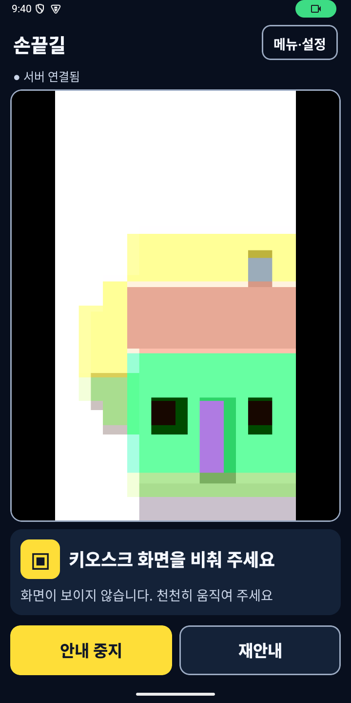
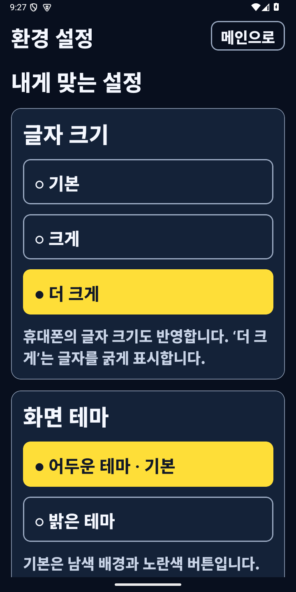
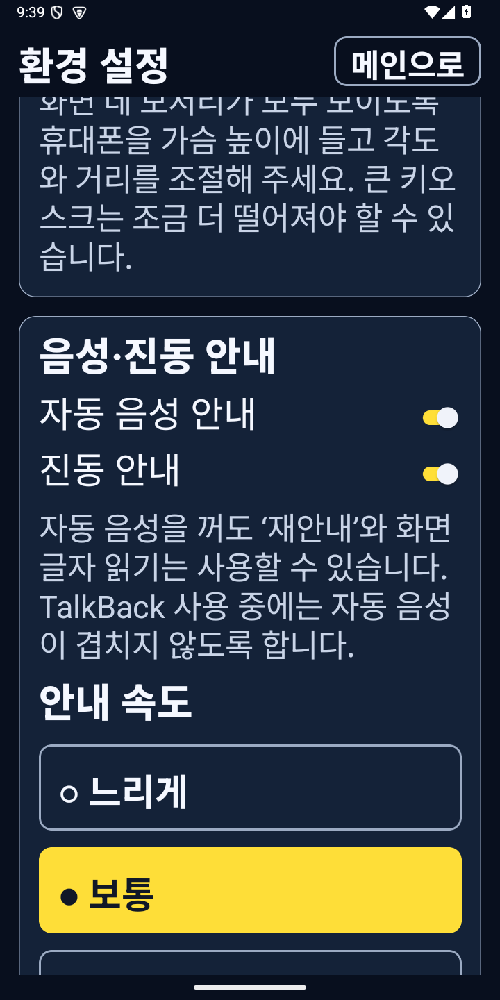
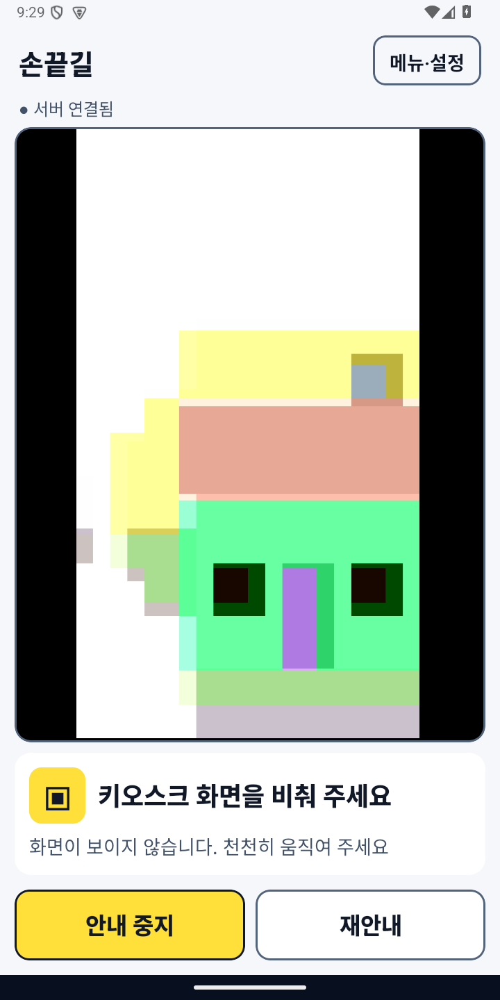

# 손끝길 앱 화면 구성과 새 UX 커밋 반영

팀의 `feature/ux-ui` 커밋 [`ed78c49`](https://github.com/fingertip-vision/sonkkeut-frontend/commit/ed78c49a4e58de7659aeef71b6ea40ff7da124b2)와 `develop`의 개발 이력을 AI·AWS 연결 작업 브랜치에 병합했습니다. 해당 커밋의 글자 크기·음성·진동·속도 설정을 현재 설치 앱에도 연결했습니다.

## 현재 설치 앱의 화면

| 화면 | 구성과 동작 | 구현 |
|---|---|---|
| 시작·메인 | 스크롤 없는 세로 카메라 공간, 연결 상태, 시작 버튼 | `App.tsx`, `src/theme.ts` |
| 안내 메인 | 영상 전체 표시, 목표 테두리, 방향·현재 자막, 고정된 중지/계속·재안내 | `App.tsx`, `src/guidance.ts`, `src/camera.ts` |
| 메뉴 | 주문 입력/확인, OCR 글자 읽기, 설정, 안내 종료, 매장 메뉴·최근 자막 | `App.tsx` |
| 주문 확인 | 말하기 또는 텍스트 입력, 메뉴·수량·옵션·금액 확인, 확인 후 안내 | `App.tsx`, `src/domain.ts` |
| 화면 글자 | 메뉴 진입 전에 읽은 실제 OCR 결과와 읽기 불확실 표시 | `App.tsx`, `src/domain.ts` |
| 환경 설정 | 글자 3단계, 두 테마, 목표 강조, 초광각, 자동 음성·진동, 속도 3단계, 음성 모델·서버·통계 | `App.tsx`, `src/settings.ts`, `src/theme.ts` |

메뉴·주문·설정 화면에서는 손끝 안내를 중지합니다. 메인 복귀 후 **안내 계속**으로 새 화면을 확인하며, 결과 미확인 담기를 보존해 중복 진행을 막습니다. 화면을 처음 인식하면 주문 입력으로 이동하고, 사용자가 주문을 확인한 뒤에만 실제 목표를 안내합니다.

글자 크기는 기본·1.15배·1.3배이며 ‘더 크게’는 굵게 표시합니다. 휴대폰 시스템 글자 크기도 적용됩니다. 기본은 남색·노란색 테마이며 고정 글자/배경 대비는 두 테마 모두 4.5:1 이상입니다. 카메라 장면과 목표 테두리 자체의 대비는 촬영 장면에 따라 달라집니다.

자동 음성은 네이티브 SDK의 `announce`, 사용자 재안내·화면 읽기는 `say`로 구분합니다. `configureFeedback`은 자동 음성·진동과 0.75/1/1.25 속도를 네이티브 출력에 적용합니다. 자동 음성을 꺼도 주문 음성 **입력**, 화면 자막과 명시적인 재안내는 사용할 수 있습니다. TalkBack touch exploration 사용 중 자동 TTS는 억제합니다. 실물 TalkBack 포커스·한국어 음성·진동 감각의 검증은 남아 있습니다.

## 실제 APK 미리보기

아래는 v0.1.7 release APK를 Android API35 에뮬레이터에 설치한 캡처입니다. 카메라 안의 장면은 테스트 영상이며 실제 키오스크 인식 성공을 나타내지 않습니다.

## 저장소의 두 빌드 경로

| 경로 | 설치 앱/역할 | 빌드 진입점 |
|---|---|---|
| `App.tsx`, `src/`, `android/` | 현재 공개 APK `com.sonkkeut` · 실제 팀 AI·OCR·Whisper 및 AWS 연결 | 저장소에서 `npm ci`, 이어 `cd android` 후 해당 Gradle Wrapper 사용 |
| `app/`, 루트 Kotlin Gradle 파일·`tools/` | 팀의 Compose 프로토타입 `com.sonkkeut.app` · 원본 합성 계산/검증 및 UX 구현 보존 | 루트 Gradle Wrapper; JDK21·SDK36.1 필요 |

현재 릴리스의 AI 연결 APK는 **`android/` 경로**에서 빌드합니다. 루트 Gradle이 만드는 Compose APK와 패키지·기능이 다릅니다. Compose 원본의 개발 내용과 기존 검사 기록은 [보존한 문서](compose-prototype.md)를 참고하세요. 원본 계산·fixture 파일은 그대로 병합했으며 이번에는 해당 별도 Compose 프로젝트 전체 빌드를 재실행하지 않았습니다. main 브랜치 병합 없이 작업 브랜치와 PR에 올립니다.

프론트 빌드에는 SDK 0.1.3이 필요합니다. `sonkkeut-ai`의 `codex/unified-ai-20261003`과 프론트를 나란히 준비하고 file dependency를 설치하세요. 현재 PC용 빌드 스크립트는 SDK 복사본도 갱신합니다. SDK 파일을 바꾼 뒤에는 네이티브 APK를 다시 빌드해야 합니다.

## 검증 범위

- Jest 54개·TypeScript·ESLint 통과.
- Android 10개 통과: 새 피드백 정책/속도/저장 4개, 기존 실제 모델·OCR·AWS·누름 안전 검사 6개. Whisper 실제 음성 테스트 1개는 해당 에뮬레이터에 모델이 설치되지 않아 생략.
- release APK에서 설정 저장·재실행 복원, 명시적 재안내 조작, 큰 앱 글자와 시스템 글자 2배, 두 테마, 카메라 프레임 처리·중지/계속을 확인.
- S26 Ultra 실물의 전체 키오스크 주문, 실제 초광각·한국어 음성·진동과 TalkBack 사용성은 미검증. 자동 음성 억제는 정책/브리지 검증이며 실제 화면 읽기 순서를 검증한 결과가 아닙니다.

SDK 적용 기준: [`a8821f3`](https://github.com/fingertip-vision/sonkkeut-ai/commit/a8821f386b08ce4ac5b56fab56df84ae34cb254a), 버전 0.1.3.
