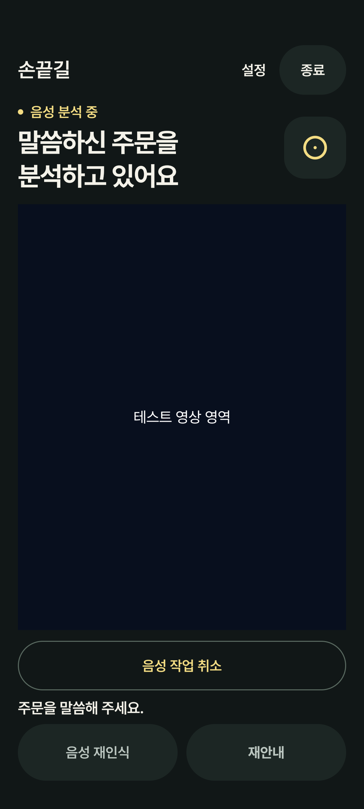
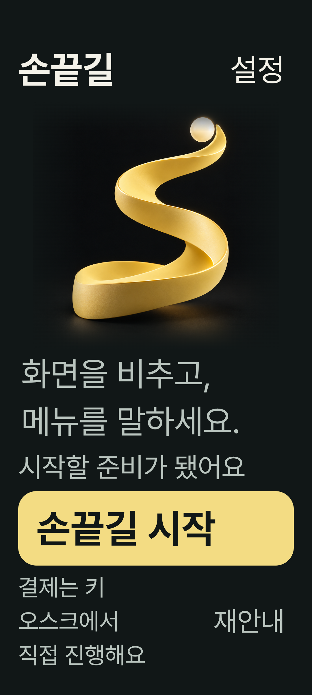
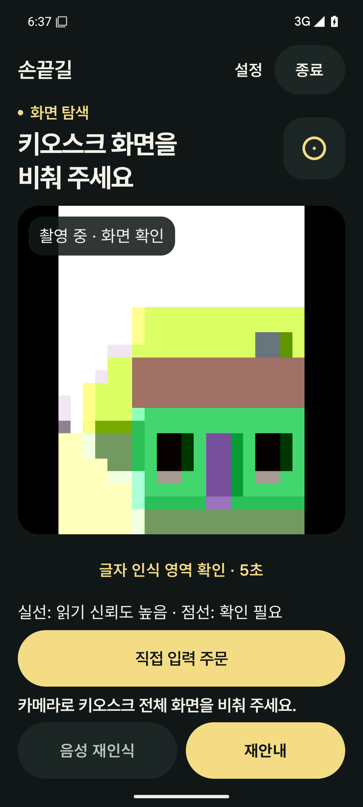

# 손끝길 0.3.1 통합 검증

2026-10-06. 프런트엔드 기준 `78799fc9daaf6b81d9b1ebf86f2df8c1171f969a`, AI 모듈 기준 `d9938b2f3e999b093942c4a882264a3fbc2ca8b8`. AI 모듈·가중치·Kotlin/Compose/CameraX 의존성은 변경하지 않았다.

## 변경

- 주문 카드에 메뉴·수량·옵션·매장/포장을 지속 표시한다. 긴 주문은 카드 안에서 확인하고 주문 팝업을 다시 열 수 있다.
- 추천/모호한 음성 후보는 현재 화면의 읽을 수 있는 메뉴와 정확한 이름 또는 유일한 별칭으로 대응하는 항목으로 제한한다. 품절·잘못된 좌표·화면 이탈·카메라 중지·1.5초 이상 갱신되지 않은 프레임·다른 키프레임은 제외한다. 표시·선택 때도 검사한다.
- 읽힌 메뉴·버튼 영역을 5초간 원근에 맞춰 표시한다. 최근 5초 내 구조와 현재 키프레임·추적 평면이 맞아야 하며, 실선/점선으로 읽기 신뢰도를 구분한다. 추가 OCR 호출은 없다. 글자 획/문장별 좌표가 없는 기존 결과를 이용한 **요소 영역 표시**다.
- 시작 화면의 본문/상태 스크롤을 제거했다. 남은 공간에 로고를 배치하고 공간·글자 크기에 따라 장식 문구를 줄인다. AI 오류는 짧은 복구 안내로 표현하며 기존 재시도 동작은 유지한다.
- 앱에서 마이크 수명주기를 관리하고 기존 `KoreanWhisper.prepare/transcribePcm`으로 같은 CT2 모델을 사용한다. 모델 준비 → 실제 녹음 → 마이크 해제 후 음성 분석 → 주문 확인을 구분한다. 기존 1.2초 무음 종료·6초 무발화 대기·30초 상한, 16kHz PCM16·VOICE_RECOGNITION·beam 5를 유지한다. 음량만으로 뒤쪽 소리를 자르면 작은 목소리를 잃을 수 있으므로 녹음된 PCM 전체를 보존한다. Whisper 변환 중에만 영상 분석을 잠시 쉬어 CPU 경쟁을 줄이고 미리보기는 계속 표시한다. 변환 완료·취소·오류 시 영상 분석을 허용하며, 낡은 안내/메뉴 결과는 기존 신선도 검사로 제외한다. 수동 종료와 취소/늦은 콜백을 분리한다.

## 결과와 한계

- Kotlin 단위 검사 **127개 통과**. 발화 중간 쉼, 수동 종료, 작은 음성 보존, 종료 상한, 화면 후보 범위와 인식 영역 투영/만료를 포함한다.
- Android 15 전용 기기에서 계측 **38개 항목 통과, ARM 전용 1개 건너뜀**. 전체 39항목의 첫 실행은 2개 실패했으며 두 실패 항목의 재검사는 통과했다.
- 첫 실패: 기존 `bundledModelsAndKoreanOcrWorkOffline`이 `option` 대신 `unknown`을 반환. 새 기기 초기 실행에서 발생했고 준비 후 단독 재검사 통과. 초기 OCR 준비/2초 대기 한계의 불안정성을 실기기에서도 확인해야 한다. AI 구현을 변경하거나 기대값을 낮추지는 않았다.
- 다른 실패: OCR 만료 조건 직후 UI의 250ms 갱신을 기다리지 않은 테스트. 실제 화면 라벨 갱신까지 기다리도록 테스트를 보완한 뒤 통과했다.
- 실제 AudioRecord 시작·취소·다음 녹음·수동 종료 후 결과 전달을 새 기기의 가상 마이크로 검사했다. 실제 한국어 발화의 Whisper 속도·정확도·소음 종료 검사는 아니다.
- 최종 음성 PCM 보존/영상 분석 스케줄 보완 후 관련 앱·마이크·화면 14항목을 재검사했다. 13항목 통과, 직접 입력 1항목은 확인 버튼을 실제 표시 영역으로 스크롤한 뒤 누르게 테스트를 보완하고 단독 재검사 통과했다. 제품 주문 해석은 변경하지 않았다.
- 기본/2.6배 글씨, 360dp 너비의 640/760dp 높이에서 스크롤 동작 부재·스와이프 후 로고 위치·시작/설정/재안내 접근을 검사했다.
- release APK `0.3.1 / versionCode 16`, ARM64, **70,019,344 bytes**. 빌드 및 release lintVital 통과. 기존 0.3.0과 서명 SHA-256이 같다.
- 새 기기에 0.3.0 설치 후 `install -r`로 0.3.1 업데이트 성공. firstInstallTime과 카메라·마이크 허용 상태가 유지됐다. 실제 release 시작 및 카메라 프레임 수신 표시를 확인했다.
- 기존 `emulator-5554`의 제품은 `0.2.4 / versionCode 14` 그대로다. 기존 APK·검증 설정을 초기화하지 않았다. 테스트/업데이트는 새 `Sonkkeut_031_QA_ASCII / emulator-5558`에서만 수행했다.
- 처음 만든 한글 경로의 QA AVD 부팅이 실패해 ASCII 임시 경로의 새 AVD를 사용했다. 연결 기기 설치에 대한 자동 승인 거절 후 기존 기기를 사용하지 않고 새 기기를 확보했다.

Whisper는 내부 log-mel을 30초 길이로 맞춰 계산한다. 입력 길이만으로 추론 시간 개선을 주장할 수 없다. 이전 0.2.4와 0.3.0의 프런트엔드 녹음 호출은 같았으며, 자동 녹음 종료 후에도 UI의 recording 상태가 추론 결과까지 유지되는 문제가 이번에 수정됐다. 기기별 실제 병목은 별도 측정해야 한다.

debug 앱은 `SonkkeutSpeechTiming` 태그에 `prepare_ms`, `capture_ms`, `transcribe_ms`, `inference_ms`, `order_analysis_ms`와 샘플 수만 기록한다. 발화·PCM·주문 내용·인증 정보는 기록하지 않으며 release에서는 이 로그를 남기지 않는다.

실물 키오스크·손끝 인식, 인식 테두리 정합, 소음·작은 목소리의 실제 종료, Whisper 첫/다음 발화 지연, TalkBack 발화·포커스, 초광각, 물리 진동 및 기존 휴대폰 음성 모델 보존은 미검증이다. 실기기 요청서는 공개 저장소/릴리스에 넣지 않았다.

## 화면

왼쪽은 고정 상태를 넣은 Compose fixture이며 실제 음성 추론 증거가 아니다. 가운데는 2.6배 글씨 fixture, 오른쪽은 전달 release APK의 실제 가상 카메라다.

| 음성 분석 상태 fixture | 큰 글씨 시작 fixture | 실제 release 카메라 |
|---|---|---|
|  |  |  |

APK SHA-256: `5ccd22daf393cda50e2912fba2afdcee8ac76d0d3674d1ec6a60a5b7dc0c16b2`.
