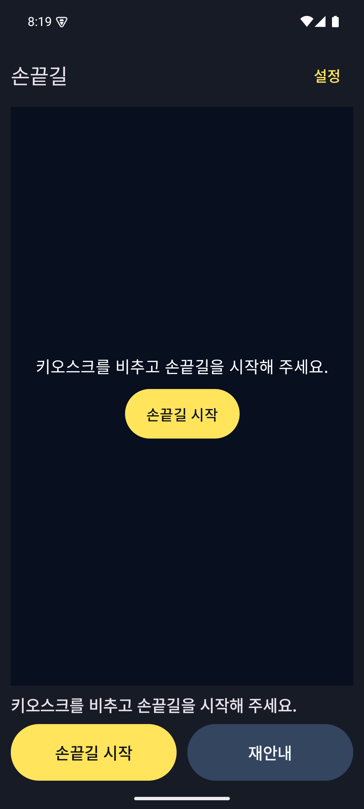
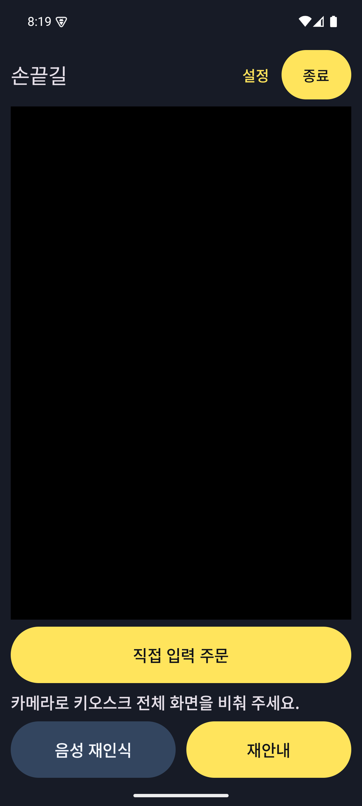
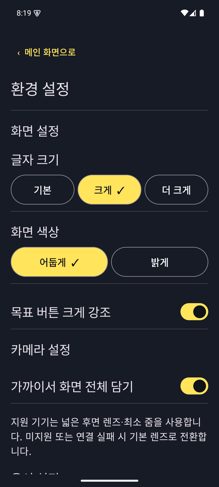
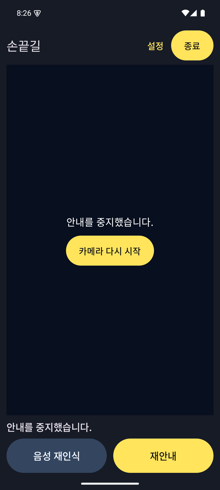
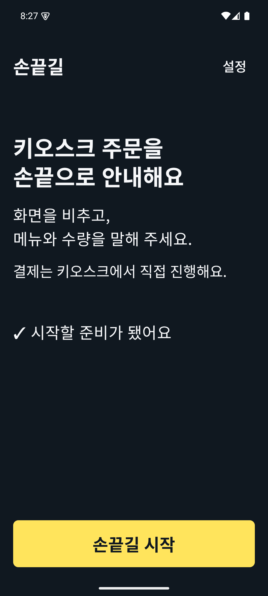
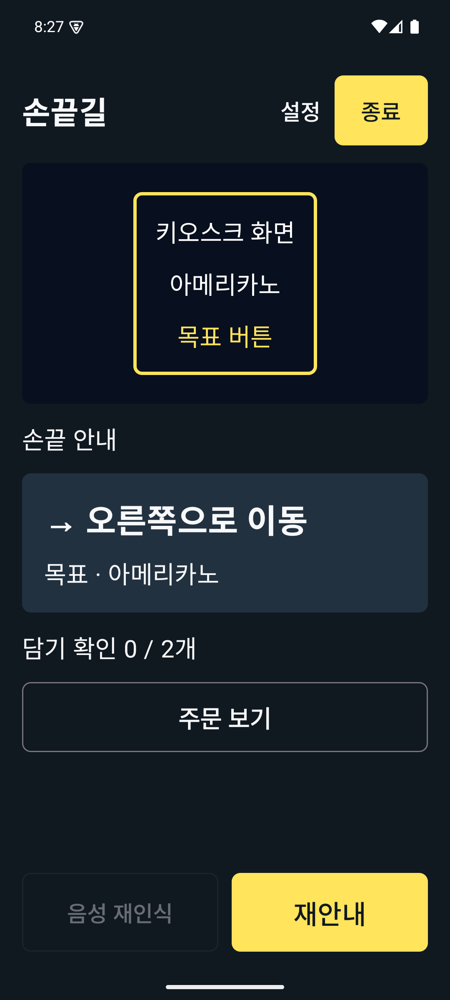
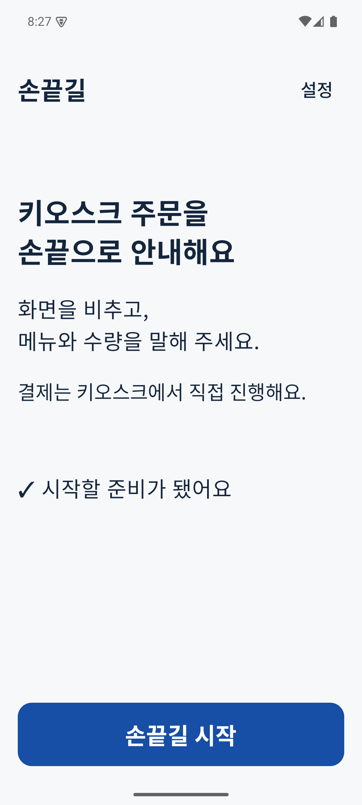
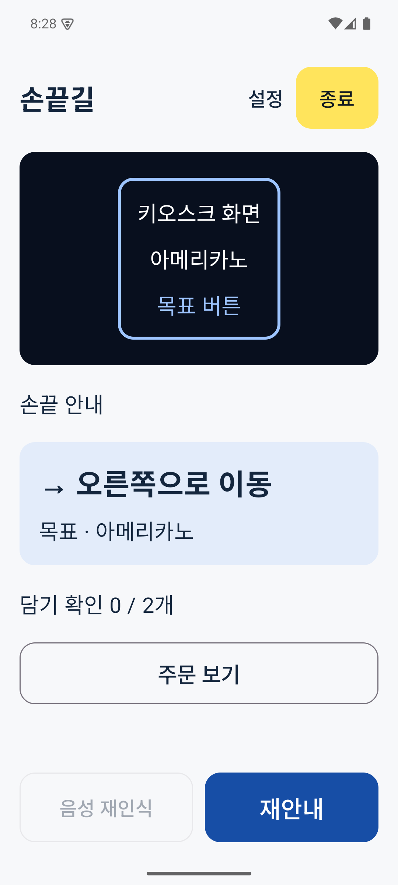
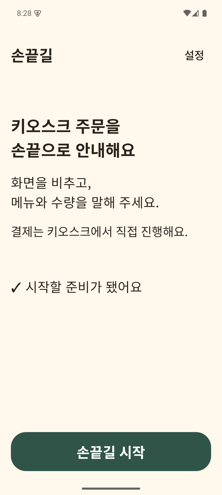
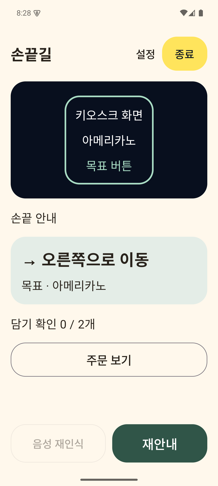

# 손끝길 Android UI/UX 진단과 방향 비교

2026-10-06 · 이번 단계는 진단과 비교이며 제품 화면 일괄 개편은 하지 않았다.

## 기준과 증거 범위

- 원격: https://github.com/fingertip-vision/sonkkeut-frontend, `upstream/develop_ui/ux`.
- `git ls-remote upstream refs/heads/develop_ui/ux`와 fetch로 확인한 기준 SHA: **dc9fdc7118687074cd0c34db0ba87cf425e63fa6**.
- 작업 브랜치: `codex/uiux-design-audit-20261006`. 형제 worktree `sonkkeut-uiux-audit`에서 작업. 원래 `sonkkeut-frontend`의 `develop_ui` 체크아웃은 유지했다. 최초 tracked/untracked status는 비어 있었으며 ignored APK·캡처도 그대로 보존했다. stash/reset/clean은 사용하지 않았다.
- 저장소/상위 경로에서 AGENTS.md를 찾지 못했다. README, `native-kotlin.md`, `develop-ui-validation-0.2.4.md`, `develop-ux-stage5.md`와 실제 Kotlin을 확인했다.
- `app-screens.md`는 React Native 당시 자료, `kotlin-ui-validation-20261006.md`는 0.2.0, stage5는 0.2.2 기록이다. 최신 0.2.4 코드/QA와 충돌하는 설명(카메라 축소·수동 확인 등)은 현재 사양으로 사용하지 않는다.
- 현재 앱: 루트 `app/`, Kotlin/Compose/CameraX, applicationId `com.sonkkeut`, Activity namespace `com.sonkkeut.app`. `App.tsx`, `src/`, `android/`는 이전 구현이다.

## 실행·빌드

JDK 17 언어 타깃, SDK35/min26/target35, Gradle8.10.2, AGP8.7.2, Kotlin1.9.25, Compose compiler1.5.15/BOM2024.09.03, CameraX1.4.1, lifecycle2.8.7, activity1.9.3, coroutines1.8.1, OkHttp4.12.0. `settings.gradle.kts`는 형제 `sonkkeut-ai/android/sonkkeut-native`를 직접 포함한다. AI HEAD는 `d9938b2f3e999b093942c4a882264a3fbc2ca8b8`, 시작 당시 변경 없음. native AI의 ONNX/ML Kit/MediaPipe, Whisper CT2 및 ARM64 네이티브 라이브러리가 필요하다. SDK/NDK/CMake 의존성과 모델은 기존 캐시를 사용한다. RN/npm 빌드가 아니다.

연결된 `emulator-5554`에서 이미 설치된 **0.2.4/code14** 앱을 실행했다. 보존된 배포 APK SHA256는 `12e705610533f7121fb8a1530961c75d847876d88031c47ba468441911a37c3f`로 최신 QA 문서와 일치한다. 설치 패키지 버전은 확인했으나 설치 바이너리 전체 해시를 비교하지는 않았다. 초기 백그라운드 전환 직후 캡처는 너무 빨라 중지 UI가 반영되지 않았으므로 충분히 대기한 재캡처를 사용한다.

현재 APK의 시작·설정·촬영 진입·백그라운드 복귀를 캡처하고 XML도 저장했다. **촬영 진입 캡처가 검은 화면이므로 프레임 수신·AI 인식 성공을 주장하지 않는다.** 권한은 이미 허용된 기기여서 첫 권한 다이얼로그는 이번에 재현하지 않았다. 실제 마이크·모델 다운로드·키오스크·주문 완료·TalkBack 사용자 검증은 수행하지 않았다. 과거 QA의 통과 수치를 이번 실행 결과로 합산하지 않는다.

비교 화면은 `app/src/debug/.../DesignComparisonActivity.kt`에 별도 작성했다. release 및 기존 MainActivity에는 연결되지 않는다. `:app:assembleDebug --offline` 빌드 성공. Android Studio @Preview용 tooling 의존성이 없어 추가 의존성 대신 실제 Compose debug Activity로 비교한다. 아래 카메라 구도는 **고정 예시**, 실제 CameraX/AI 결과가 아니다. 버튼은 디자인 검토용 무동작이다. 최종 에뮬레이터에는 비교용 debug APK를 잠시 설치한 후 기존 0.2.4 release APK를 복원한다.

### 현재 앱 캡처

| 시작 | 촬영 진입 |
|---|---|
|  |  |

| 설정 | 백그라운드 복귀 |
|---|---|
|  |  |

## 화면·상태 지도

표의 '관찰'은 이번 앱 실행, '코드'는 기준 커밋 소스를 의미한다. 사용자가 보는 상태는 flowState 하나가 아니라 ready/running/paused/recording/speechBusy/orderConfirmationOpen과 결합된다.

| 화면/상태 | 현재 동작과 전환 | 증거 |
|---|---|---|
| 시작·AI 준비 | 준비 전 시작 비활성. 준비 후 설정·손끝길 시작·재안내 표시. 시작 화면에는 종료 없음 | 관찰 current.xml; MainActivity125–196, NativeAppModel 초기화 |
| 카메라 권한 | 시작 시 CAMERA 요청. 허용하면 start. 거절 시 카메라 권한 허용 버튼 유지. 영구 거절용 시스템 설정 이동 UI는 확인되지 않음 | 코드 MainActivity64–70,129–133 |
| 마이크 권한 | 음성 주문 시 RECORD_AUDIO 요청. 허용 후 home/running/비중지 조건 확인, 거절 안내. 직접 입력 대체 가능 | 코드 MainActivity70,90–98,162–165 |
| 촬영 준비·화면 탐색 S2 | FIT_CENTER 전체 프레임, 기본/넓은 후면 렌즈와 최소 줌, 실패 시 기본 렌즈 대체. 화면·매장 메뉴 준비 후 주문 요청 | 관찰 camera는 검은 화면; 코드 NativeCamera, model.accept/start |
| 음성 모델 준비 | Whisper만 사용. 약485MB 모델 별도 창과 다운로드. 미설치면 직접 입력 유도 | 코드 MainActivity120–122, model.refreshSpeechStatus/downloadSpeech |
| 음성 입력 | recording 중 말하기 완료, speechBusy 중 음성 작업 취소. 자체 TTS를 녹음 중 억제 | 코드 MainActivity161–168; model.listen/finishSpeech/cancelSpeech |
| 분석 중 | 음성 추론·주문 해석/메뉴 보정. 세대 번호로 늦은 응답 무효화. 취소 가능, 성공·오류·후보로 분기 | 코드 NativeAppModel309–342,397–408 |
| 직접 입력/오류 S3 | 주문 문장·입력한 주문 확인. 모호한 메뉴/미등록/품절/수량/옵션 오류는 자동 진행 차단. 후보 한 개씩 전환, 선택 뒤 수량·옵션 재입력 | 코드 MainActivity170–190; NativeOrder/NativeOrderFlow |
| 주문 확인·자동 안내 | 정상 주문마다 카메라 위 하단 팝업 표시→주문 음성 완료→자동 안내. TTS 꺼짐/미준비/터치 탐색 시 표시 후 진행. 별도 승인 버튼 없음 | 코드 MainActivity104–118,143–145; model.orderConfirmationPresented |
| 주문 확인 페이지 | 카메라 컨테이너 크기 유지, 팝업 최대50%. 짧은 주문 페이지 버튼 없음. 긴 주문 이전·다음, 닫기/주문 보기, 담기 진행 변화로 쪽수 초기화하지 않음 | NativeOrderConfirmation; 최신0.2.4 QA(이번 주문 재현 아님) |
| 손끝 안내 S4 | 목표 테두리, AI event.speak 기반 손끝 안내와 message 자막. 현재 목표와 다른 이벤트·오래된 결과 폐기. 음성·진동·재안내 | 코드 CameraOverlay, model.accept, GuidanceOutput. visualGuidance()는 별도 상태 문구 helper지만 현재 UI에서 호출하지 않음 |
| 누르기/결과 확인 S5 | 지금 누르세요 후 실제 화면 변화·담기 확인 전 다음 목표로 진행하지 않음. 중단된 담기 보존·검증 | NativeOrderFlow.touch/verify/recover |
| 완료 S6 | 주문 수량·장바구니 금액 확인 후 결제 화면에서 안내 종료. 앱이 결제하거나 키오스크를 대신 누르지 않음 | NativeOrderFlow.plan |
| 실패·복구 SE | 인식/버튼/수량/금액/중단 담기 오류는 진행 차단. 화면 다시 확인. 카메라 오류 시 중지·다시 연결. 모델/음성 오류는 직접 입력 대체 | MainActivity134–140,192; NativeOrderFlow; model.recoverScreen |
| 설정 | 화면 크기1/1.15/1.3 × 시스템 글자 배율, 밝게/어둡게, 목표 강조·넓은 카메라, 음성·진동·속도0.75/1/1.25. 저장·복원 | 관찰 settings; AccessibilitySettings |
| 설정 복귀 | 안내 중 설정 진입은 중지, 돌아오면 cameraGranted 등 조건에 따라 새 화면 확인 후 자동 재개 | model.open/closeEnvironmentSettings |
| 백그라운드 복귀 | ON_STOP에서 출력·카메라 중지 및 재개 예약 취소. ON_RESUME는 권한/출력 준비만 갱신. 카메라 다시 시작 수동 실행 | 관찰 resume; MainActivity74–76, model.stopForBackground |
| 종료·뒤로 | 상단 노란 종료는 세션 초기화. 뒤로는 팝업→입력 닫기/설정 복귀 등 상태별 분기, 실행 중 기본 뒤로는 설정 진입 | MainActivity102–111; model.end |

### 의도적으로 제거·미구현한 항목

기기 음성 인식·음성 제공자 선택, 인식 원문/보정 결과 창, 수동 '안내 시작', 안내 계속/중지, 서버·매장 변경 UI, 화면 전체 읽기·상세 OCR·통계 동의 UI는 이전 UX에서 의도적으로 제거됐다. 해당 내부 연결/추론/저장 코드는 일부 유지된다. **음성 재인식은 아직 미구현이며 비활성 상태를 유지**한다. 오류 수정이나 디자인 개편의 명목으로 복원하지 않는다. 기능 상태를 'AI가 고장난 버튼'으로 오해하지 않게 준비 중을 명시한다.

## 현재 문제와 근거

| 문제 | 근거·확신도 | 영향과 제안 |
|---|---|---|
| 시작 CTA·상태 중복 | current.xml에 손끝길 시작 2개, 같은 안내 문장2개. MainActivity 비활성 카메라 대체 UI + NativeStatus + NativeHomeActions. 관찰 확정 | 시각·TalkBack 반복. 하단 단일 시작 CTA로 통합하고 중앙은 설명/준비 상태만 유지. 같은 start 콜백 사용 |
| 상태 표시가 모호해질 수 있음 | NativeStatusText가 2줄 넘으면 주문 확인 필요/화면 확인 필요로 치환. 코드 확정, 모든 문구 실제 출력은 미검증 | 큰 글자에서 원인과 다음 행동 소실. 상태 패널에 핵심 지시+복구 버튼, 자세한 이유는 확장 가능한 텍스트·동일 의미 semantics |
| 설정 상단의 세로 탐색량 | settings 캡처에 아래 음성 설정이 화면 밖. 의도된 스크롤이며 잘림 버그 판정 아님 | 섹션 heading 유지, 현재 선택 상태 읽기. 큰 글자에서 선택 세로 전환 유지 |
| 프리뷰 위 테두리 대비 변동 | CameraOverlay 단일 노란3/5dp 테두리. 코드 확정 | 밝은 키오스크 장면에서 경계 소실 가능. 외곽 어두운+내부 밝은 이중선, 좌표/FIT_CENTER 보존 |
| 고정 하단 행의 큰 글자 충돌 위험 | NativeHomeActions 두 weight 버튼, 가변 입력/상태는 카메라와 높이 경쟁. 코드에서 추정. 0.2.4 QA는2.6배 주문 페이지 통과 | 시스템+앱 배율/좁은 폭/키보드 조합 별도 검사. 버튼 최소 높이·줄바꿈, 상태와 입력만 제한적 스크롤 |
| 비활성 재인식이 큰 공간 사용 | camera 캡처, NativeHomeControls의 stateDescription 준비 중. 의도된 사양 | 기능 활성화 없이 준비 중 표기·보조 스타일로 낮추기. 숨기기는 탐색 순서 변경이므로 UX 별도 검토 |
| 카메라 검은 화면과 실제 준비 상태 구분 | camera 관찰. 카메라 원인 진단은 이번 범위 밖 | 프레임 수신/대기/오류의 표시를 별도 설계. 임의 타임아웃 자동 재시작은 동작 변경 |
| 손끝 상태 전용 표시의 연결 공백 | visualGuidance()의 UI 호출 없음. MainCameraLayout도 NativeApp에서 사용하지 않음. 코드 확정 | 미사용 레이아웃을 현재 화면으로 착각하지 않는다. 제안 지시 패널은 현재 message/event 의미를 보존하고 helper 연결은 상태 문구/출력 정책 검토 후 진행 |
| TalkBack/TTS 상호작용 검증 공백 | 자동 TTS는 touch exploration에서 억제, NativeStatus liveRegion polite, explicit 재안내는 TTS 사용. 코드 확정 | 실제 읽기 순서·중복·팝업 접근성을 직접 검사해야 함. 정책 코드만으로 접근성 통과 주장 금지 |

## 동일 내용으로 비교한 시각 방향

시작: 손끝길/설정, '키오스크 주문을 손끝으로 안내해요', 촬영·메뉴와 수량 안내, 키오스크 직접 결제, 준비 완료, 단일 시작 CTA.
카메라: 손끝길/설정/노란 종료, 같은 목표 아메리카노·오른쪽 이동·0/2개, 주문 보기, 비활성 재인식, 재안내. 촬영 구도는 고정 예시다. 순서와 의미를 동일하게 유지했다.

| 방향 | 글자·여백·버튼·안내 | 장점·검토점 |
|---|---|---|
| **A 명확한 신호 · 추천** | 남색#101820/흰#F7F8FA/노랑#FFE45C. 제목34sp, 지시30sp, 본문22–24sp. 간격16dp,8dp 모서리,72dp 주요 버튼. 어두운 안내 패널에 큰 방향+목표 | 기존 남색·노랑 정체성 연속성. 기능 위계와 촬영 주변 대비 명확. 어두운 화면 선호가 모든 저시력 사용자에게 동일하지 않으므로 밝은 테마 병행 |
| B 차분한 안내 | 밝은#F7F8FA/남색#14263D/파랑#174EA6. 제목32sp, 간격24dp,16dp 모서리. 옅은 파랑 안내 패널, 흰 글자 파랑 CTA | 밝은 화면 선호에 적합, 정보 구역 구분 명확. 야외/빛번짐과 버튼 강조 비교 필요 |
| C 따뜻한 동행 | 크림#FFF8EC/진갈색#29231C/녹색#305548. 제목30sp, 간격20dp,28dp 모서리. 부드러운 녹색 안내 패널, 같은30sp 지시 | 따뜻한 인상과 대비 양립. 친근함이 실시간 이동 지시의 명료함을 떨어뜨리지 않는지 사용자 확인 필요 |

설계 목표: 주요 글자 대비7:1, 경계·상태 표시3:1 이상. 비교 토큰의 본문/CTA 대비는 계산할 수 있지만 카메라 영상·disabled 색·MaterialTheme 전체를 이 목표로 검증했다고 간주하지 않는다. 의미는 색 단독이 아니라 글자·방향 기호·상태명으로 함께 표시한다.

### 실제 Compose 비교 캡처

| A 시작 | A 카메라 |
|---|---|
|  |  |

| B 시작 | B 카메라 |
|---|---|
|  |  |

| C 시작 | C 카메라 |
|---|---|
|  |  |

## 접근성·출력 설계

- 제목30–34sp, 핵심 이동30sp, 본문22–24sp, 버튼22–26sp가 비교 기준. 시스템 배율을 상한으로 자르거나 글자를 축소하지 않는다. 기존 앱 배율 곱셈을 보존하며1.0/1.3/2.0/2.6,320dp 폭,가로·키보드·화면 inset에서 검사한다.
- 상단 설정→종료, 하단 재안내 위치를 상태 간 안정적으로 유지. 시작 화면에서는 종료 없음. 팝업 표시/닫기가 카메라 크기를 바꾸지 않아야 한다. 좁은 폭에서 하단 행의 최소 높이를 유지하고 글자 줄바꿈; 공간 부족 시 중간 설명/입력 영역만 스크롤한다.
- TalkBack 계획: 화면 제목→설정→종료(실행 중)→현재 지시와 목표(합쳐 읽기)→주문 내용/쪽수/닫기 또는 주문 보기→입력/복구→하단 행동. Compose isTraversalGroup/traversalIndex는 시각 순서와 함께 검증, heading과 selected/stateDescription 유지. 장식적 프레임·기호는 독립 포커스에서 제외한다.
- 지시는 '오른쪽으로 이동, 목표 아메리카노'처럼 한 번 읽는다. 매 프레임 포커스를 이동시키거나 liveRegion을 갱신하지 않는다. 같은 지시 중복 제거 정책과 targetAttempt/announcementNumber는 유지한다. 시작 CTA의 이중 탐색 노드 제거가 우선이다.
- 주문 팝업은 자동 안내를 막는 승인창으로 바꾸지 않는다. 팝업 접근·닫기 후 주문 보기·현재 페이지 복원, TalkBack 읽는 도중의 새 상태 처리를 검사한다. 강제 포커스/읽기 완료를 기다린 자동 진행 지연은 UX 변경으로 별도 결정한다.
- touch exploration 중 자동 TTS 억제를 보존. 명시적 재안내는 기존대로 제공. TalkBack 음성과 앱 재안내의 겹침은 실기기에서 확인한다. 음성 꺼짐에도 텍스트·재안내, 진동 꺼짐에도 지시·방향을 유지한다.
- 진동 패턴/빈도·누르기 신호, 녹음 중 출력 억제, 한국어 오프라인 TTS, 오디오 포커스, 늦은 음성 결과 취소를 변경하지 않는다. 새 진동 의미를 추가하려면 별도 사용자 학습과 UX 승인이 필요하다.

## 대표 화면 구현 계획

1. **시작/권한/준비**: NativeHomeToolbar/Actions와 비활성 카메라 대체 영역을 presentation component로 분리. 동일 ready/cameraGranted/start 콜백으로 단일 CTA, 설명·준비 상태 위계 적용. 권한 허용/거절/미준비 branch 보존.
2. **카메라 안내**: NativeCamera·CameraOverlay의 좌표계/FIT_CENTER/lifecycle을 그대로 두고 토큰·이중선·지시 패널만 교체. 지시 원문은 visualGuidance/message를 통해 전달하고 별도 UI 추론 금지. order popup 최대50%·카메라 치수 고정 유지.
3. **음성·분석·주문**: 녹음/분석/다운로드/입력/오류·후보 각각에 같은 버튼 위치/문구 위계 적용. speechGeneration과 cancel 유지. 정상 주문 팝업→readOrder completion→orderConfirmationPresented 순서를 그대로 사용. 주문 parser/메뉴 보정/추천/금액·수량 확인 미수정.
4. **설정/복귀/복구**: 기존 저장 키·글자 배율·자동 재개 조건 유지. 설정은 섹션·선택 상태만 정돈. SE/카메라 오류/모델 없음/권한 거절에 해당 콜백과 이유를 명확히 노출한다.
5. **검증 게이트**: 기존83개 단위·NativeAppTest/NativeOrderLayoutTest 관련 회귀, 동일 주문 재입력·팝업 닫기/재열기·짧은/긴 페이지·2.6배, 카메라 컨테이너 치수, 설정 자동 복귀와 background 수동 복귀, 주문 미확정/품절/중단 담기 차단. 실제 TalkBack 탐색/중복 읽기, 마이크/TTS/진동, 실제 키오스크 전체 주문은 별도 실기기 세션. 이번 비교 빌드 성공을 이러한 검증의 대체로 삼지 않는다.

### 시각 변경과 별도 UX 제안

**시각 범위**: 색·글자·간격·shape·위계·테두리·단일 시작 CTA(동일 콜백)·같은 의미 상태 문구. 비활성 재인식과 노란 종료 유지. UI만 교체하고 AI·주문·카메라 상태 머신과 generation/확인/복구 조건 유지.

**별도 UX 검토 필요**: 영구 권한 거절에서 시스템 설정 이동, 재인식 버튼 숨김/활성화, 주문의 수동 승인 복원, 녹음 자동 시작 정책 변경, 읽기 완료까지 자동 안내 지연, 새로운 카메라 timeout 재시작, 진동 패턴 변경, 완료/배경 복귀 자동 시작, 제거된 OCR/서버/매장 UI 복원. 이번에는 구현하지 않는다.

추천은 A를 기본으로 시작·카메라 두 화면부터 좁게 적용하고 B의 밝은 테마를 함께 검증하는 것이다. 기존 브랜드와 조작 위치를 유지하면서 실제 관찰된 중복·상태 위계 문제를 먼저 해결한다. C는 사용자 선호 비교 대상으로 남긴다. 세 방향 중 사용성을 입증한 결과는 아직 없다.
