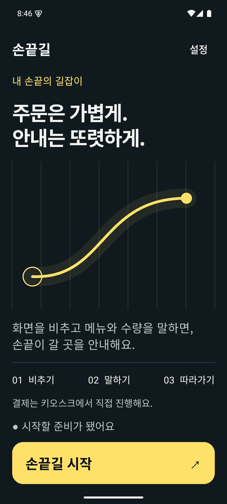
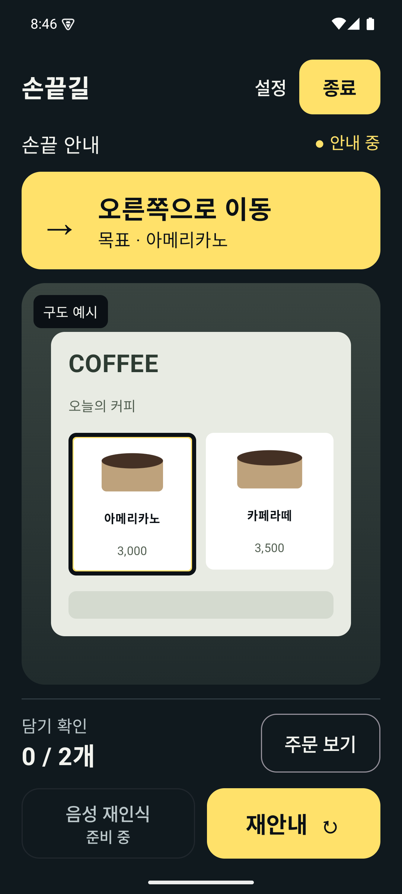
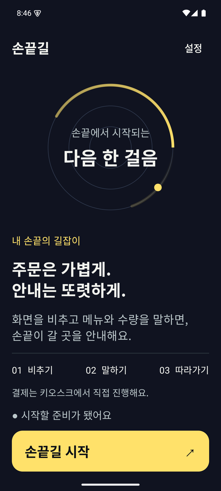
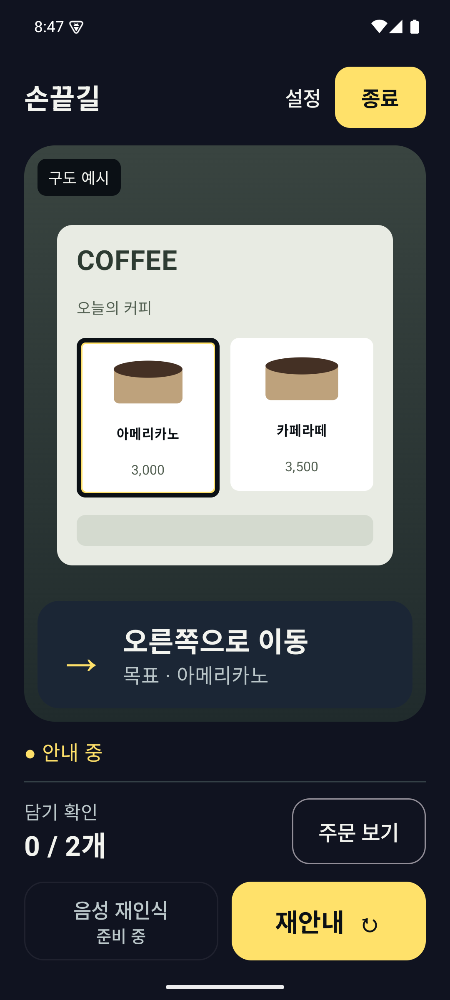
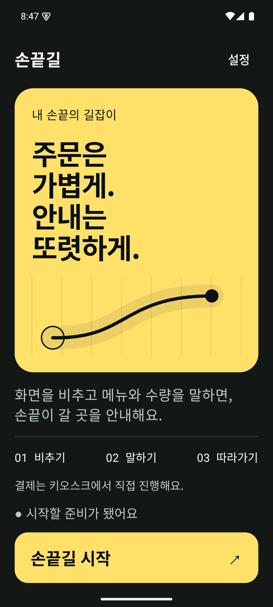
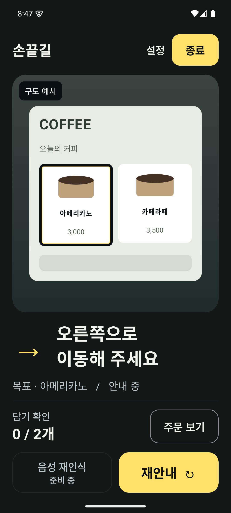

# 손끝길 이벤트 시안 3개

손끝길 이벤트 시연용 앱의 시작·카메라 안내 화면으로 해석했다. 별도 이벤트 등록/운영 페이지는 만들지 않았다. 기준 브랜치·기능 보존 범위는 기존 진단과 동일하다.

## 1. Signal / 카메라 중심형

Oura의 절제된 어두운 표면과 Google Maps의 상단 다음 행동 안내를 조합했다. 시작은 큰 제목과 그리드 위 경로 그래픽, 안내는 노란 지시 띠와 넓은 촬영 영역으로 구성한다. 카메라 내용을 가리지 않고 즉시 행동을 읽기 좋아 실제 사용 후보로 추천한다.

| 시작 | 안내 |
|---|---|
|  |  |

## 2. Orbit / 계기판형

Oura의 상태 링을 준비 화면 모티프로, 카메라 위 고정 하단 패널을 안내 모티프로 삼았다. 차분한 남색·정밀한 원형 선·목표 영역과 붙어 있는 지시를 사용한다. 행사 시연에서 기술적인 인상이 강하지만 실제 CameraX 연결 시 패널이 영상의 하단을 가리는 점을 검토해야 한다.

| 시작 | 안내 |
|---|---|
|  |  |

## 3. Bold / 브랜드 강조형

Revolut의 중심 요소 위계와 Spotify의 강한 주요 행동을 참고했다. 시작의 노란 브랜드 면과 크게 끊어 읽는 제목, 안내의 독립적인 큰 화살표로 차이를 만든다. 전시·발표에서 눈에 띄는 방향이다. 큰 밝은 면이 모든 저시력 사용자에게 적합하다는 뜻은 아니다.

| 시작 | 안내 |
|---|---|
|  |  |

공통 내용: 촬영→메뉴/수량 입력→손끝 안내, 키오스크 직접 결제, 목표 아메리카노, 오른쪽 이동, 담기0/2개. 설정·노란 종료·비활성 음성 재인식·재안내 유지. 모션·실시간 상태·AI 연결은 하지 않은 debug 전용 정적 시안이다. 카메라 장면은 Compose로 그린 예시이며 인식 성공 증거가 아니다.

구현: `EventConcepts.kt`, DesignComparisonActivity `--ei eventConcept 0|1|2 --ez camera false|true`. 빌드 의존성 변경 없이 assembleDebug offline 성공. 기본 글자 크기에서 에뮬레이터 화면을 캡처해 확인. 큰 글자/TalkBack/실물 키오스크 사용성은 추가 검증 필요. 캡처 뒤 기존0.2.4 release APK를 복원한다. release 화면과 상태 머신은 변경하지 않았다.

레퍼런스: [Oura](https://play.google.com/store/apps/details?id=com.ouraring.oura), [Google Maps](https://play.google.com/store/apps/details?id=com.google.android.apps.maps), [Spotify](https://play.google.com/store/apps/details?id=com.spotify.music), [Revolut](https://play.google.com/store/apps/details?id=com.revolut.revolut). 앱 그래픽·로고·화면을 복사하지 않고 화면 원리를 재해석했다.
