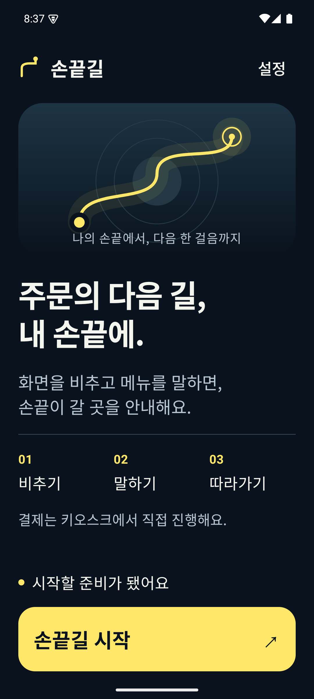
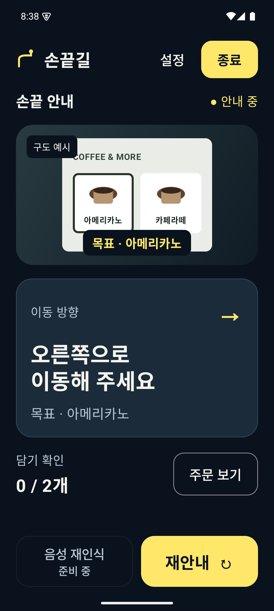

# A 명확한 신호 · 두 번째 시안

2026-10-06. 동일 기준 작업 브랜치의 debug 전용 Compose 비교 화면. 기존 제품 UI/AI/주문/CameraX에는 연결하지 않았다.

브랜드 모티프는 손끝에서 목표까지 이어지는 길이다. 남색 #09121D, 종이빛 흰색 #F4F5EE, 신호 노랑 #FFE76A를 사용한다. 큰 제목과 정돈된 여백, 얇은 경계와 깊이가 있는 표면, 노란 행동 버튼으로 첫 시안의 기본 컴포넌트 인상을 줄였다.

시작 화면은 경로 심볼 → 큰 브랜드 문장 → 사용 방법 → 준비 상태 → 고정 시작 버튼. 카메라는 촬영 영역 → 이동 지시 → 주문 진행 → 고정 재안내. 노란 종료·미구현 재인식·키오스크 직접 결제 안내는 보존한다. 카메라 속 커피 메뉴는 Compose로 그린 구도 예시이며 실제 촬영/인식 결과가 아니다. 실제 영상은 향후 이 위치에 FIT_CENTER로 연결한다.

| 시작 | 카메라 안내 |
|---|---|
|  |  |

큰 제목40sp, 이동 지시32sp, 본문22sp, 버튼24–26sp. 화면 하단 행동은 고정하고 큰 글자에서 중간 영역만 스크롤 가능하게 했다. 핵심 안내를 합쳐 읽는 semantics와 준비 중 stateDescription 적용. 그래픽·작은 번호·카메라 그림은 장식/예시이며 실사용 지시는 큰 글자로 별도 제공한다. 실기기 TalkBack·시스템 확대 검증 완료를 의미하지 않는다.

`:app:assembleDebug --offline` 통과, emulator-5554에서 두 화면 캡처 후 시각 검사. 단계 문구 줄바꿈·하단 잘림을 확인해 높이와 배치를 수정하고 재캡처했다. 캡처 후 기존0.2.4 release APK를 복원했다. 비교 Activity의 버튼은 무동작이며 모션과 실시간 상태 전환은 아직 구현하지 않았다.

소스: `app/src/debug/java/com/sonkkeut/app/RefinedSignalStudy.kt`. 실행: DesignComparisonActivity intent에 `--ez refined true --ez camera false` 또는 `true`. 빌드 의존성 변경 없음.
