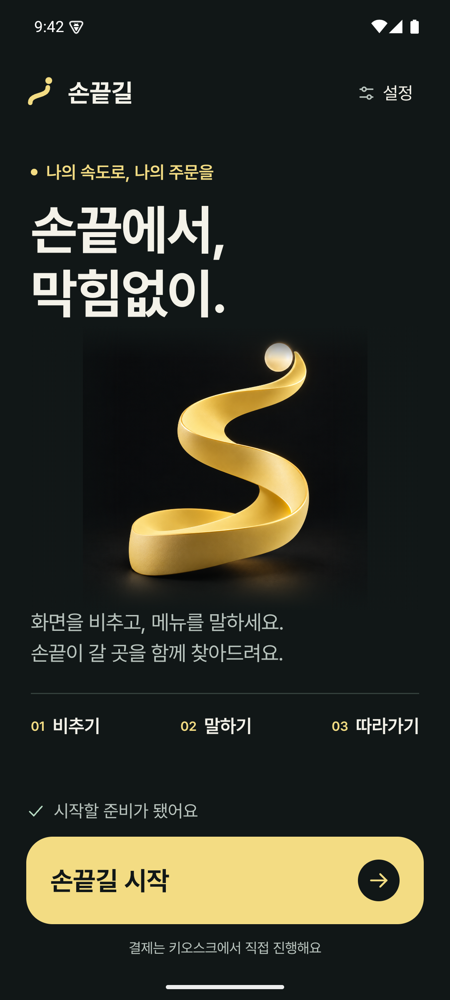
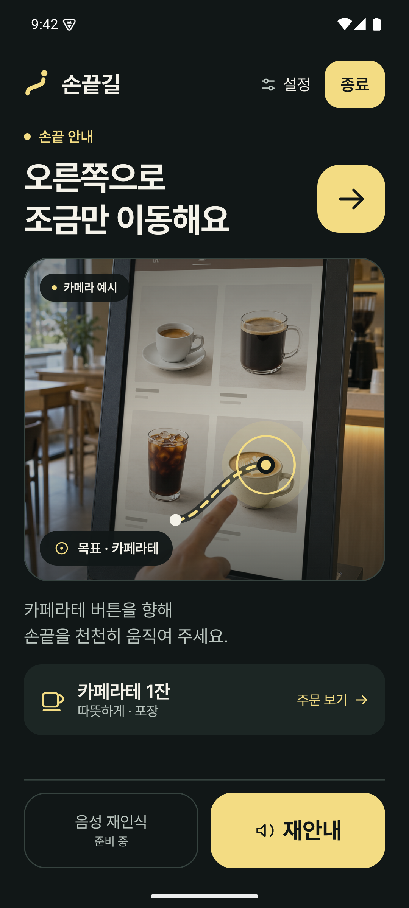
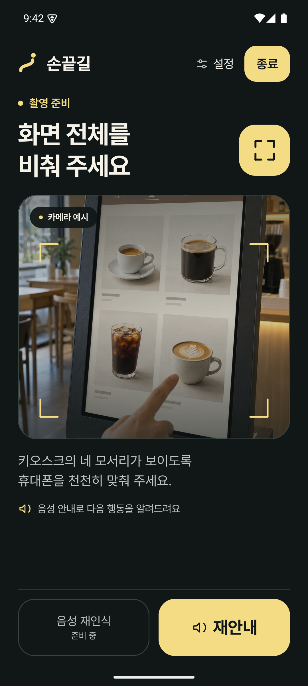
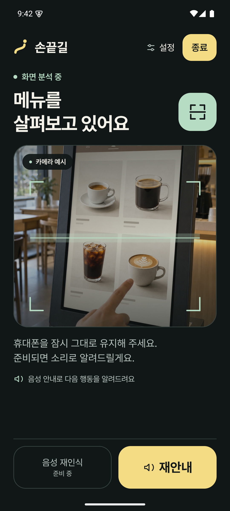
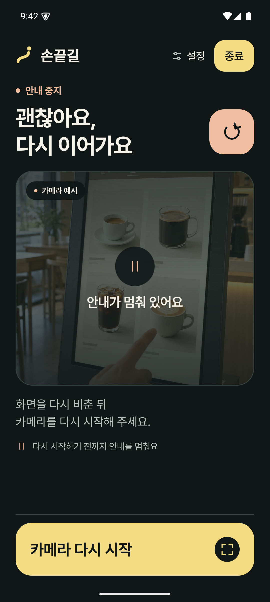

# 손끝길 · Signal Studio

2026-10-06. ‘명확한 신호’를 발전시킨 대표 화면의 실행 가능한 Compose 시안.
기준 커밋 `dc9fdc7118687074cd0c34db0ba87cf425e63fa6`. 최초 작업 브랜치는 `codex/uiux-design-audit-20261006`이며, 확인된 디자인은 포크 `hy2oni/sonkkeut-frontend`의 `develop_ui_design`에 보존한다. 후속 기능 통합은 이 커밋에서 분기한 `develop_ui_update`에서 진행한다.

## 실제 Compose 캡처

| 시작 | 손끝 안내 |
|---|---|
|  |  |

| 촬영 준비 | 분석 중 | 중지·복구 |
|---|---|---|
|  |  |  |

[2배 글씨](captures/signal-large-2.0.png) · [2.6배 글씨](captures/signal-large-2.6.png)

이전 비교 기준은 [Event Signal](../event-concepts.md)의 시작·안내 화면이다. 기존의 단순 도형 경로를 독자적인 입체 이미지와 통일된 심볼로 발전시켰고, 한글 서체·크기·간격을 정돈했다. 안내 화면은 다음 행동, 실제 영상 영역, 주문 보기, 하단 조작의 위계를 명확히 했다. 처음으로 시안 내 상태 선택·복귀·주문 확인·큰 글씨 조작도 구현했다.

## 디자인

시작 화면의 중심은 큰 한글 제목과 손끝의 길을 표현하는 입체 리본이다. 카메라 안내 화면은 같은 색·서체·곡률을 사용하면서 다음 행동을 가장 먼저 읽게 한다. 움직임은 등장과 목표 표시의 짧은 전환에만 사용한다.

| 요소 | 값·역할 |
|---|---|
| 배경 / 표면 | `#111717` / `#1C2624` |
| 주요 글자 / 보조 글자 | `#F4F2E9` / `#BAC5BF` |
| 신호 / 준비 / 복구 | `#F3DC83` / `#B7DCC4` / `#F1BDA1` |
| 서체 | Pretendard Regular·SemiBold·Bold, 공식 OFL 1.1 글꼴 |
| 주요 제목 | 시작 49sp/58sp, 안내 34sp/42sp |
| 본문 / 버튼 | 18–19sp, 주요 버튼 23–24sp, 높이 76–80dp 이상 |
| 여백 / 곡률 | 화면 24–28dp, 간격 8/12/18/24dp, 큰 모서리 22–26dp |
| 움직임 | 시작 이미지 650ms, 안내 상태색 320ms, 목표 표시 420ms. 반복 애니메이션 없음 |

기본 글자 대비 16.16:1, 보조 글자/배경 10.21:1, 버튼 글자/신호색 13.27:1, 보조 글자/표면 8.75:1. sRGB 상대 휘도 계산이며 실제 사용자 평가를 대신하지 않는다.

## 화면과 상태

- 시작: 준비 상태 → 손끝길 시작. 설정 진입과 키오스크 직접 결제 안내.
- 촬영 준비: 키오스크 전체를 비추는 안내와 모서리 표시.
- 분석: 기다리는 이유와 유지할 동작 안내. 가짜 인식률·진행률을 표시하지 않는다.
- 손끝 안내: 오른쪽 이동, 목표 위치, 주문 보기, 재안내. 음성 재인식은 기존과 같이 비활성.
- 복구: 안내 중지와 명시적 ‘카메라 다시 시작’. 백그라운드에서 복귀해도 자동으로 안내를 재개하지 않는다.

카메라는 생성한 예시 이미지다. AI 인식·촬영·주문 성공을 주장하지 않는다. 상태 선택은 설정의 ‘시안 둘러보기’에서 수행한다. 이 패널은 시안 검토 도구이며 제품 설정 개편안이 아니다.

## 접근성

읽기 순서는 상단 조작 → 현재 상태·핵심 안내 → 카메라 예시 → 설명·주문 보기 → 하단 조작이다. 변하는 상태 영역만 polite live region으로 지정하고 장식·경로는 읽기 대상에서 제외했다. 카메라는 단일 설명으로 읽도록 묶었다. 의미를 색상에만 의존하지 않는다.

큰 글씨에서는 브랜드 장식과 방향 아이콘을 줄이고, 카메라를 축소하며, 재안내를 하단 전체 폭으로 표시한다. 2.6배에서는 안내 제목을 24sp/31sp에 확대 배율을 적용해 표시하고 어절 단위로 줄바꿈한다. 주문 카드는 세로로 배치한다. 본문은 스크롤해 접근할 수 있고 하단 주요 조작은 고정된다. 시스템 글자 크기는 존중한다. 설정의 2배 글씨·움직임 줄이기는 시안 내부에서만 적용한다.

재안내는 시안에서 접근성 알림·짧은 화면 알림·기기 햅틱 요청을 사용한다. 제품 TTS·진동 조합을 새로 구현한 것이 아니다. 실제 TalkBack 읽기·한국어 음성·물리 진동 체감은 미검증이다. 제품 연결 시 자체 TTS와 TalkBack의 중복 읽기를 AnnouncementGate와 함께 검증해야 한다.

## 제품 연결 시 구분할 사항

이번 변경은 `ui-tooling-probe/src/debug/`와 그 검증 호스트에 한정했다. 제품의 MainActivity, 상태 머신, AI, CameraX, 주문, 음성 코드는 변경하지 않았다. 이전 시안도 보존했다.

시각 변경으로 옮길 항목: 색·서체·여백·버튼·아이콘·상태별 표현·모션 토큰.
별도 UX 검토가 필요한 항목: 큰 글씨의 카메라 높이와 본문 스크롤, 주문 보기 카드의 배치, 복구 문구, 자체 TTS와 접근성 알림의 중복 방지. 기존 주문 팝업의 자동 표시·긴 주문 페이지·카메라 크기 보존 규칙을 확인한 뒤 연결한다.

## 검증 결과

- `:ui-tooling-probe:assembleDebug` 성공. 기존 BOM·Kotlin·AGP 유지, 추가 런타임 라이브러리 없음.
- 최종 APK에서 Compose 계측 **7개 통과, 실패·생략 0**. 새 시안 검사 6개와 기존 도구 검사 1개다.
- 새 검사: 시작·종료·복구, 주문 팝업 재열기와 음성 재인식 비활성, 분석/안내 중 주요 버튼 위치, 2배·2.6배 글씨의 종료·재안내·주문 접근, 백그라운드 복귀 후 수동 재시작.
- Maestro **전체 터치 흐름 1개 통과**. 시작 → 준비 → 분석 → 안내 → 주문 확인 → 복구 → 재시작 → 종료. 첫 실행에서 시안 패널 아래 항목이 가려지는 문제를 발견해 전체 펼침으로 수정한 뒤 통과했다.
- API 35 Sonkkeut_Event_Test에서 캡처. 시안 내부의 fontScale만 변경하여 기기의 글씨 설정은 보존했다.
- 실제 TalkBack 탐색·읽기, 스크린리더와 제품 TTS의 상호작용, 실물 키오스크·AI·CameraX·음성 입력은 미검증.

로그: `artifacts/signal-studio/build.txt`, `compose-tests.txt`, `maestro-report.xml`. 계측 XML: `ui-tooling-probe/build/outputs/androidTest-results/connected/debug/`. 제품 단위 테스트 83개는 도구 준비 단계의 결과이며 이번 시안 작업에서 재실행하지 않았다.

## 설치와 실행

APK: `../../../artifacts/sonkkeut-signal-studio-20261006.apk`. 패키지 `com.sonkkeut.tooling`이므로 제품 `com.sonkkeut`을 교체하지 않는다. 기존 UI 도구 검증 앱을 업데이트하며 기존 도구 화면도 유지한다.
APK 크기 16,372,530 bytes, SHA-256 `4a05cee320aead52287d125eb38818323bd6afc3b2f7d7e2448750aeb9a4e25d`.
설치 후 **손끝길 · Signal** 아이콘을 연다. ‘손끝길 UI 도구 검증’ 아이콘은 기존 도구 화면이다. 시작을 누르면 촬영 준비 화면, 설정에서 다른 상태와 큰 글씨·모션 설정을 선택할 수 있다.

```powershell
. ./tools/ui/environment.ps1
./gradlew.bat :ui-tooling-probe:assembleDebug
adb -s emulator-5554 install -r ui-tooling-probe/build/outputs/apk/debug/ui-tooling-probe-debug.apk
adb -s emulator-5554 shell am start -n com.sonkkeut.tooling/com.sonkkeut.tooling.design.SignalDesignActivity --es scene home
maestro --device emulator-5554 test tools/ui/signal-studio.yaml
./gradlew.bat :ui-tooling-probe:connectedDebugAndroidTest
```

지원하는 `scene`: home, ready, analyzing, guidance, recovery. 글씨 비교: `--ef fontScale 2.0`, 모션 축소: `--ez reduceMotion true`. 재현 캡처 시에는 이 패키지만 `am start -S`로 다시 연다.

## 제작 도구·출처

Context7에서 Android 공식 Compose 접근성 문서를 조회했고 현재 프로젝트 버전에 맞춰 구현했다. 이미지 두 개는 내장 imagegen으로 제작했으며 프롬프트는 `asset-prompts.md`에 기록했다. Figma 파일이 제공되지 않아 임의 파일 생성·조회는 하지 않았다. 단순 상태 전환에는 Compose Animation을 사용했다.

- [Pretendard 공식 배포처](https://github.com/orioncactus/pretendard), [동봉 라이선스](PRETENDARD-LICENSE.txt)
- [Compose 접근성 탐색 순서](https://developer.android.com/develop/ui/compose/accessibility/traversal)
- [Compose semantics](https://developer.android.com/develop/ui/compose/accessibility/semantics)

원본 이미지는 `ui-tooling-probe/src/debug/res/drawable-nodpi/signal_path.png`, `kiosk_sample.png`. 글꼴·이미지는 검증 APK에만 포함되며 release 제품으로 유입되지 않는다.
