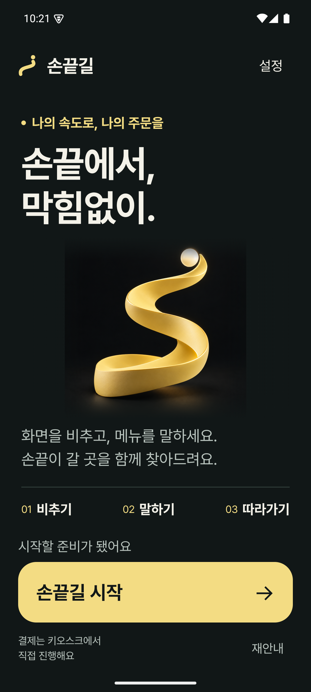
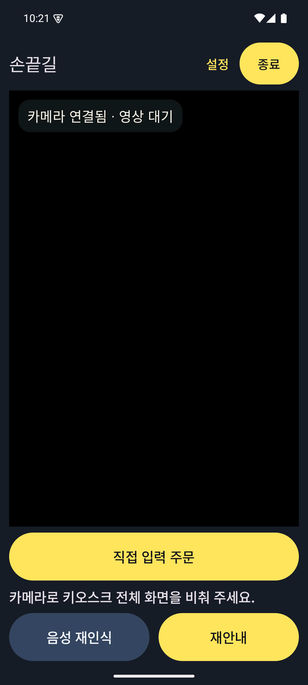
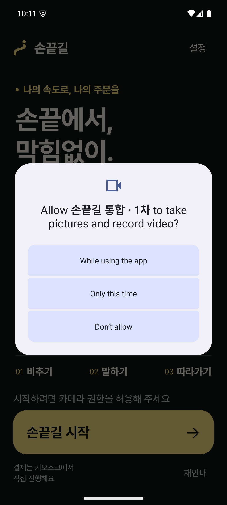
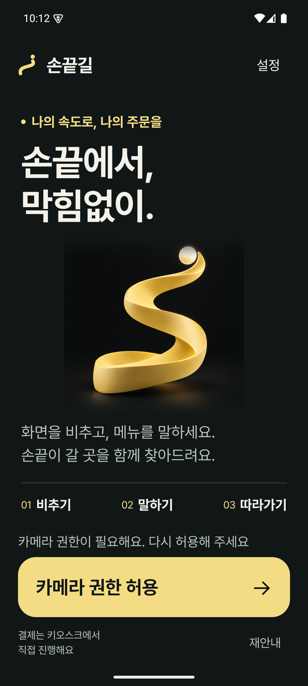
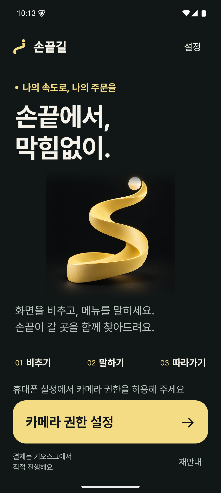
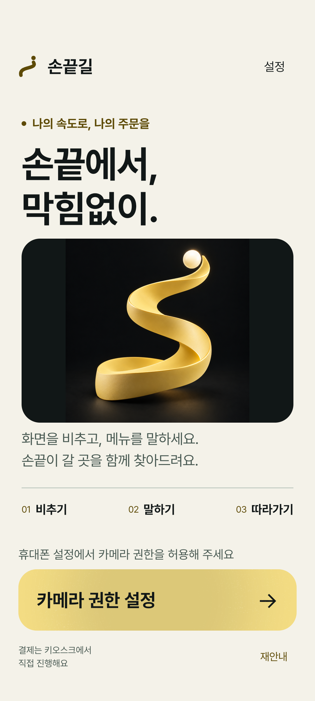
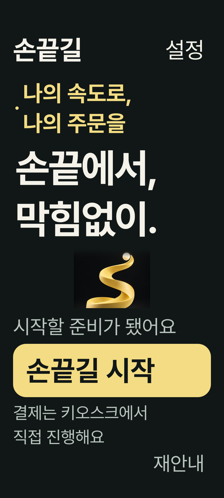

# 1차 · 시작 화면과 기존 CameraX 연결

2026-10-06. 작업 브랜치 `develop_ui_update`, 시작 커밋 `2b53f36fb9ca1bdaa96ad260a8aa76268f87783e`.
디자인 기준은 보존한 `develop_ui_design`, 제품 기능 기준은 0.2.4의 `dc9fdc7118687074cd0c34db0ba87cf425e63fa6`이다.

## 세 단계 중 현재 범위

1. **이번 결과:** 실제 준비 상태를 표시하는 시작 화면, 카메라 권한 요청·거절·설정 복구, 기존 앱 모델과 CameraX 진입.
2. 다음 결과: 주문·음성·실시간 손끝 안내 화면의 디자인 통합. 실제 AI 결과에 근거한 목표·방향만 표시.
3. 마지막 결과: 설정·실패 복구·접근성 전반과 통합 APK 검증.

이번 카메라·주문·설정 화면은 기존 레이아웃을 유지한다. 전체 디자인 통합이 완료된 APK가 아니다.

## 실제 앱에서 캡처한 화면

| 새 시작 화면 | 기존 CameraX 진입 |
|---|---|
|  |  |

촬영 진입 캡처는 검은 프리뷰와 ‘카메라 연결됨 · 영상 대기’ 상태다. 이 사진은 프레임·키오스크·손끝 인식 성공의 증거가 아니다. 별도의 기존 프레임 증가·중지·재개 자동 테스트는 에뮬레이터에서 통과했다. 두 결과의 범위를 혼동하지 않는다.

| 시스템 권한 요청 | 거절 후 재요청 | 반복 거절 후 설정 이동 |
|---|---|---|
|  |  |  |

[백그라운드 복귀](captures/stage1-resume.png).

다음 두 장은 제품의 `SignalWelcome` 컴포넌트에 고정 상태를 주입한 **레이아웃 테스트 호스트 캡처**다. 실제 AI 상태나 권한 동작을 증명하지 않는다. 기기 글자 설정을 바꾸지 않고 Compose 내부 배율로 2.6배를 확인했다.

| 밝은 테마 · 권한 설정 상태 | 2.6배 글씨 · 준비 완료 상태 |
|---|---|
|  |  |

## 구현과 동작 변경

- `SignalWelcome.kt`: 시작 화면을 실제 `ready`, 준비 실패 메시지, 권한 상태에 연결한다. 준비 전 시작 비활성. 저장된 밝은 테마·앱 글자 배율·시스템 글자 배율을 유지한다. 본문은 스크롤하고 주요 시작 버튼은 하단에 둔다.
- `MainActivity.kt`: 실행 전 홈만 새 시작 화면으로 교체한다. 기존 `start()`, 권한 런처, 설정 진입, 실제 재안내에 콜백을 연결한다. 시안의 고정 카페라테 주문·상태 전환 메뉴·카메라 예시 이미지·곡선 경로는 가져오지 않았다.
- 카메라 바인딩 설정, FIT_CENTER, 렌즈 선택, 좌표 변환, AI 처리·주문 모델·음성 출력은 유지한다. 연결 상태 문구만 추가한다. 연결됨과 신규 처리 결과 수신을 구분하며, 처리 결과를 받아도 손끝 인식 성공이라고 표시하지 않는다.
- 카메라 세션이 새로 생길 때 연결 상태와 처리 프레임 기준을 다시 잡는다. 시작 화면을 나갈 때만 기존 CameraX 컴포넌트가 생성된다.
- 제품 리소스에 승인한 브랜드 이미지와 공식 Pretendard 세 굵기·OFL 라이선스를 포함했다. 모델·도구 체인·라이브러리 버전 변경은 없다.

시각 변경에 더해 의도적으로 바뀐 UX는 **중복 시작 버튼을 하나로 통합**, 시작 설명의 스크롤 허용, **권한 반복 거절 시 시스템 앱 설정으로 이동하는 복구 경로**다. 시스템 설정에서 권한을 허용하고 돌아오면 상태를 갱신하되 사용자가 시작 버튼을 누른다. 주문 음성 후 자동 안내, 카메라 크기와 주문 팝업, 앱 복귀 후 수동 재시작 등의 기존 규칙은 유지했다.

## 검증

- 변경 전 단위 테스트 태스크 성공, 기존 결과 83개 확인. 이 실행은 Gradle 캐시를 재사용했다.
- 변경 후 단위 테스트를 강제 재실행: **86개 통과**, 실패 0. 기존 83개 + 준비·권한 복구·카메라 상태 판별 3개.
- 실제 앱 계측 **16개 통과**, 실패·생략 0: 기존 `NativeAppTest` 8개, `NativeOrderLayoutTest` 3개, 새 `SignalEntryIntegrationTest` 2개, `SignalWelcomeLayoutTest` 3개.
- 실제 버튼 → 모델의 실행 상태 → CameraX 바인딩, 종료 → 새 시작 화면, 백그라운드 복귀 후 수동 재시작을 검사했다. 카메라 프레임 처리 검사 성공은 가상 기기의 결과다.
- 별도 패키지에서 Maestro 실제 터치 흐름 **1/1 통과**: 시작, 카메라 바인딩, 홈 이동·복귀, 수동 재시작, 종료, 기존 설정 왕복.
- Android 시스템 UI에서 최초 권한 창, 거절, 재요청, 반복 거절, 해당 앱 설정으로 이동, 설정에서 허용, 돌아온 뒤 시작 가능 상태를 확인했다. 이 과정에서 기존 제품의 권한은 변경하지 않았다.
- debug 통합 APK와 제품 release 빌드·release 필수 lint 성공. 마지막 큰 글씨 하단 배치 보정 후 증분 산출물이 갱신되지 않은 문제를 발견해 `--rerun-tasks`와 Windows 한글 경로용 `-Dfile.encoding=COMPAT`로 전체 빌드를 재실행했다. 새 APK 해시와 수정된 렌더를 확인하고 계측 16개를 모두 다시 통과했다. 중복 실행을 별개의 검사 개수로 합산하지 않는다.
- 실제 TalkBack·한국어 TTS와 스크린리더의 상호작용·물리 진동·실물 렌즈/초점·손끝/키오스크 인식 정확도는 미검증이다.

로그는 로컬 `artifacts/integration-stage1/`의 `baseline-unit.txt`, `tests.txt`, `build.txt`, `release-build.txt`, `final-layout-build.txt`, `final-rebuild-tests.txt`, `instrumentation-final.xml`, `maestro-report.xml`, 권한 UI XML과 제품 설치 비교 기록에 보관한다.

## 설치·재현

전달 APK: 로컬 `artifacts/sonkkeut-ui-update-stage1.apk`.
크기 77,029,251 bytes, SHA-256 `2485e238e5b5d9c96178b28f2b24b27797d95e15eb62c05c1076782920c6fa48`.
**앱 이름 `손끝길 통합 · 1차`, 패키지 `com.sonkkeut.uiupdate`.** 기존 `com.sonkkeut` 및 디자인 시안 `com.sonkkeut.tooling`과 함께 설치된다. 이 APK는 `:app`의 실제 기능 코드이며 별도 시안 앱이 아니다. 기존 설치의 데이터·설정·음성 모델을 공유하지 않는다.

```powershell
. ./tools/ui/environment.ps1
./gradlew.bat :app:assembleDebug -PuiIntegrationSandbox=true --offline --rerun-tasks '-Dorg.gradle.jvmargs=-Xmx3072m -Dfile.encoding=COMPAT'
adb -s emulator-5554 install -r app/build/outputs/apk/debug/app-debug.apk
adb -s emulator-5554 shell am start -n com.sonkkeut.uiupdate/com.sonkkeut.app.MainActivity
```

`-PuiIntegrationSandbox=true`는 debug 빌드만 별도 패키지로 만든다. 이 옵션 없는 debug와 release는 기존 제품 패키지다. 테스트 설치 때 옵션·대상 패키지를 확인한다. release 빌드는 확인만 했으며 기기에 설치하거나 공개 릴리스로 배포하지 않았다.

기존 제품의 설치 경로·버전·업데이트 시각·카메라/마이크 권한이 작업 전후 동일했다. 설치된 제품 APK SHA-256은 `12e705610533f7121fb8a1530961c75d847876d88031c47ba468441911a37c3f`, 시스템 font_scale은 `1.0`으로 유지됐다.

## 휴대폰에서 남은 1차 확인

1. 별도 통합 APK를 열고 카메라 허용 후 실제 키오스크 영상이 나오는지 확인한다.
2. 앱을 잠시 나갔다가 돌아와 자동 촬영이 재개되지 않고 ‘카메라 다시 시작’으로 재개되는지 확인한다.
3. 종료를 눌렀을 때 새 시작 화면으로 돌아오는지 확인한다.

실제 주문·손끝 안내의 정확도와 새 디자인 연결은 2차에서 다룬다. 촬영 자료·로그를 받기 전에는 실기기 확인 완료로 기록하지 않는다.
