# 2차 · 주문·음성·손끝 안내 디자인 통합

2026-10-06. `develop_ui_update`, 기준 커밋 `2b53f36fb9ca1bdaa96ad260a8aa76268f87783e` 위의 1차 통합 작업을 이어서 진행했다. [1차 결과](../stage1/README.md)와 APK를 보존했다. 이 문서는 1차·2차 통합 소스와 검증 결과를 기록하며, 브랜치의 소스 반영과 공개 APK 배포는 별개다. 설정 화면을 비롯한 **3차 통합은 아직 진행하지 않았다.**

## 실제 앱 화면

아래는 별도 패키지 `com.sonkkeut.uiupdate`에서 기존 매장 메뉴와 주문 모델을 사용해 진행한 **실제 앱 계측 캡처**다. 직접 주문 입력 → 주문 팝업 표시 → 기존 규칙에 따른 자동 안내 → 닫기·다시 열기를 확인했다. 카메라에 보이는 색상 패턴은 Android 에뮬레이터의 가상 영상이다. 키오스크·손끝 인식 성공을 의미하지 않는다. 인식 근거가 없으므로 이동 화살표도 표시하지 않는다.

| 실제 주문 입력 | 주문 팝업 | 팝업을 닫은 안내 화면 |
|---|---|---|
| 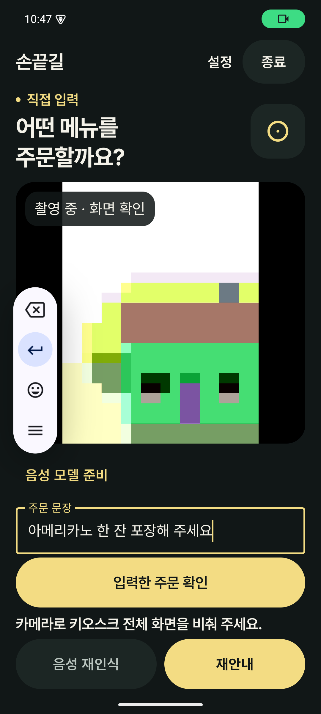 | 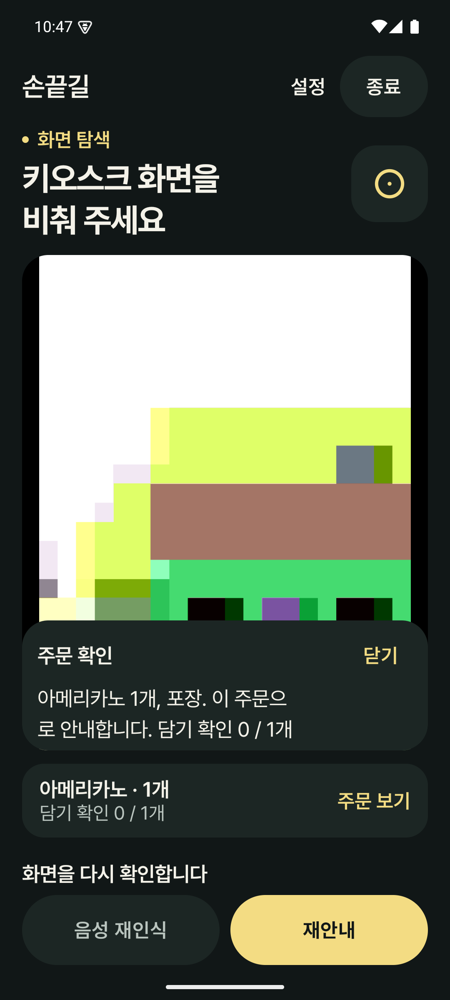 | 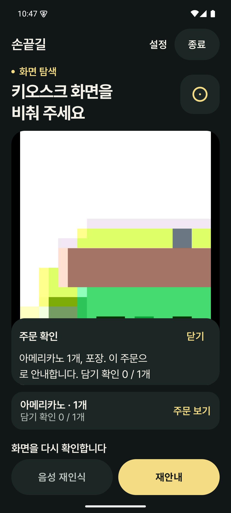 |

Maestro 실제 터치로 확인한 [카메라 진입](captures/stage2-camera-actual.png)과 [음성 모델 준비 창](captures/stage2-voice-model-actual.png). 모델 다운로드 버튼을 누르거나 기존 앱 데이터를 초기화하지 않았다.

## 상태별 디자인 검증

다음은 제품의 `SignalSession`, `SignalSpeechControls`, `SignalOrderPanel`에 고정 상태를 주입한 **Compose 레이아웃 테스트 캡처**다. 녹음·인식·손끝 검출이 실제로 성공했다는 증거가 아니다. 테스트 영상 영역을 명시하고 시안의 가짜 키오스크 사진이나 이동 경로를 제품에 넣지 않았다.

| 주문 듣기 | 처리 중 | 실제 이벤트 형태를 주입한 이동 안내 |
|---|---|---|
| 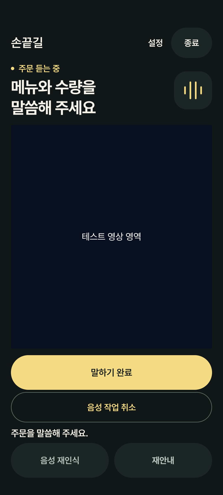 | 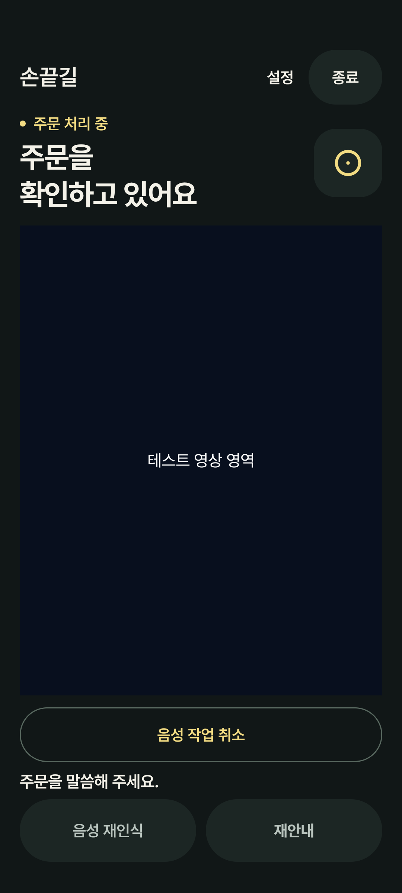 | 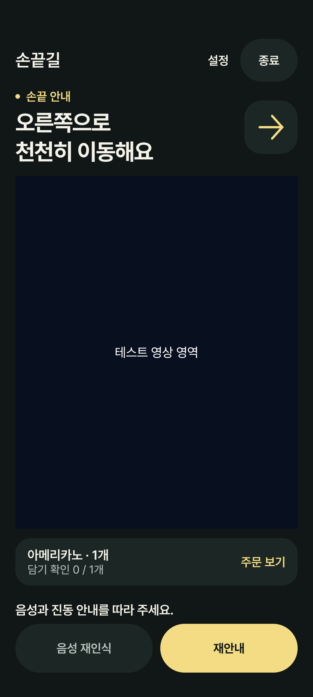 |

| 손끝 미검출 | 누르기 신호 | 결과 확인 |
|---|---|---|
| 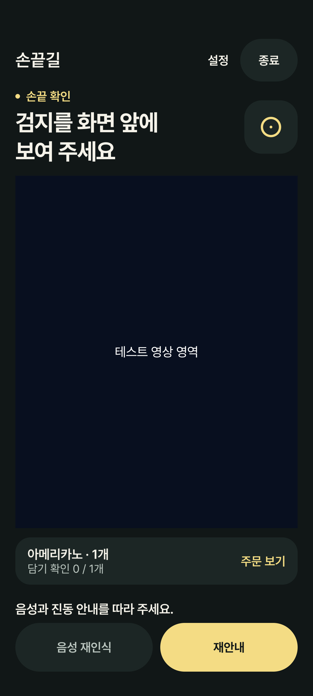 | 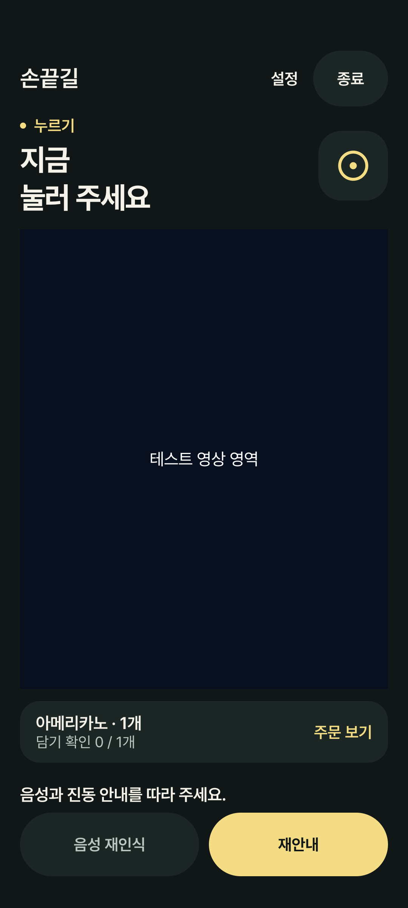 | 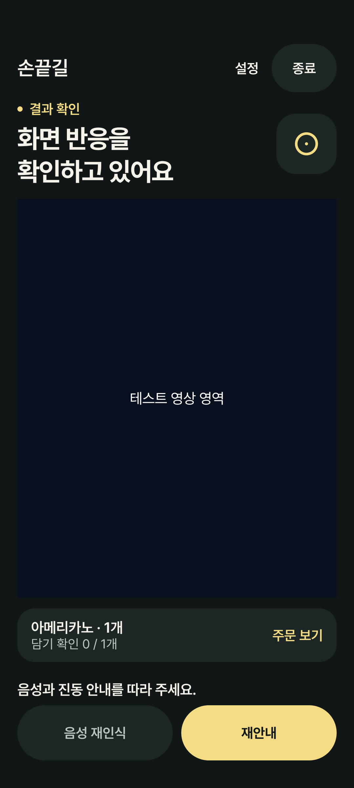 |

| 밝은 테마 | 글씨 2.6배 · 긴 주문 페이지 | 오류 상태 |
|---|---|---|
| 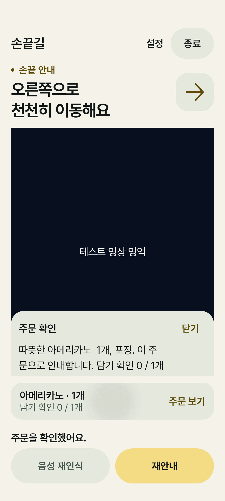 | 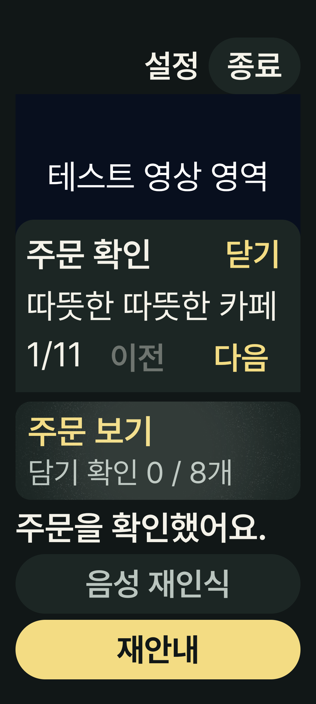 | 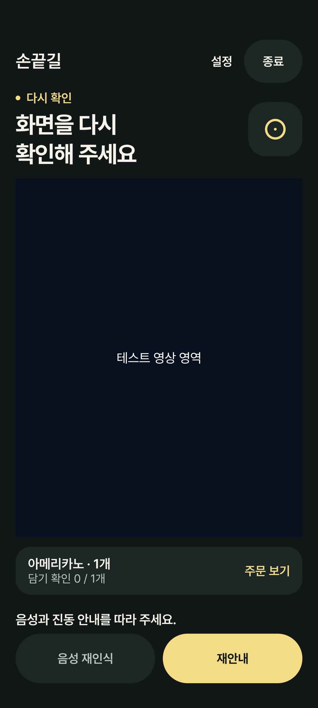 |

## 무엇을 연결했나

- 승인한 Signal의 잉크색·골드·Pretendard를 실제 촬영 중 화면에 적용했다. 큰 상태 제목, 방향 표식, 모서리가 둥근 실제 CameraX 영상, 주문 카드, 하단 재안내로 구성한다. 종료는 상단에 유지하고 주 행동과 재안내를 골드로 구분한다.
- 음성 모델 준비, 주문 말하기, 말하기 완료, 취소, 직접 입력, 주문 확인, 후보 선택은 기존 `NativeAppModel` 콜백에 연결한다. 자체 Whisper, Android TTS, `GuidanceOutput` 및 기존 진동 정책을 교체하지 않는다. 후보를 선택했다고 주문을 자동 확정하지 않는다.
- 주문 확인은 기존 페이지 컴포넌트를 사용한다. 팝업은 카메라 영역의 절반 이내에 겹쳐 표시하고, 열고 닫을 때 카메라 크기를 바꾸지 않는다. 주문 음성 안내 후 자동 진행하며 새 ‘확정 후 시작’ 단계를 추가하지 않는다. 주문 보기는 기존 팝업을 다시 연다.
- CameraX의 렌즈 선택, FIT_CENTER, 해상도, 프레임 분석, 중지·복귀 정책을 유지한다. 방향·상태가 바뀌어도 카메라 슬롯을 재생성하지 않는다. 상세 글자 읽기·기기 음성 인식 등 제거된 진입점은 복구하지 않는다. 음성 재인식은 기존 비활성 자리 표시 상태다.
- `SignalSessionPreview.kt`는 debug 전용 편집기 Preview다. 라이브러리·Kotlin·AGP·Compose·AI 모델 버전 변경 및 추가 에셋 다운로드는 없다.

## 시각 변경과 구분되는 UX 보완

1. **근거가 있는 안내만 표시:** 수신 프레임의 시각, 대상 시도 번호와 현재 대상 ID, 실제 이벤트의 대상 ID, 손끝 좌표·신뢰도·검지 자세를 확인한다. 현재 대상과 다르거나 대상이 사라졌거나 1.5초가 지난 프레임이면 방향·대상 테두리를 표시하지 않는다. 음성 입력·주문 처리·직접 입력·중지 중에도 숨긴다. 프레임 수신 시도 번호는 결과 처리 중 다음 대상을 선택하기 **전**에 기록한다.
2. **방향을 추측하지 않음:** 8방향 표시는 엔진의 유효한 `direction` 이벤트에서만 나온다. 대상 사각형의 위치나 S4/S5 상태만으로 화살표·경로를 만들지 않는다. 대상 테두리는 유한하고 올바른 순서이며 프레임 안에 있는 좌표만 기존 FIT_CENTER 변환으로 그린다. 저시력 대상 표시 설정도 유지한다.
3. **누르기와 결과 확인 구분:** 실제 `press` 명령이 있을 때만 누르기를 표시한다. 한 프레임 명령이 너무 짧게 지나가지 않도록, 동일 시도의 최신 결과가 계속 손끝의 목표 도달·신뢰도를 뒷받침하는 동안 최대 1.2초 유지한다. 이후 결과 확인으로 바꾸며 실제 성공·실패는 기존 엔진 판정에 맡긴다. ‘누르기’는 접촉 성공을 검출했다는 뜻이 아니다. 오래된 방향·누르기 문장이 하단 상태에 남지 않도록 같은 표시 정책을 적용한다.
4. **큰 글씨 배치:** 1.6배 이상에서는 본문 스크롤과 충분한 카메라 높이를 사용한다. 주문 팝업이 열리면 해당 영역을 보이게 이동한다. 주문 카드의 메뉴명 요약 대신 주문 보기·담기 확인을 넓게 표시하고, 전체 내용은 팝업 페이지에서 읽는다. 하단 버튼을 세로로 배치해 단어가 좁은 버튼에서 끊어지는 문제를 줄인다. 기본 배율의 버튼 위치는 고정한다.
5. **읽기 순서:** 상단 조작 → 상태·카메라·주문·입력 → 하단 상태·재안내 순서로 traversal group을 둔다. 상태 제목은 heading, 방향 그림은 장식으로 처리하고 동일 방향의 한글 제목을 읽는다. 빈번한 방향 변경에 새 live region이나 TTS·진동을 추가하지 않는다. 기존 상태와 주문 페이지 읽기, 팝업 paneTitle은 유지한다. 실제 TalkBack 발화의 충돌 여부는 실기기 검증 항목으로 남긴다.

1.5초/1.2초는 **UI 표시용 기준**이다. AI·주문 판정·기존 음성 및 진동 임계값을 바꾸지 않는다. 장치별 처리 속도와 현장 사용성을 확인한 뒤 조정할 수 있다.

## 검증 상태

- 최종 코드 단위 검사 **96개 통과**, 실패·오류 0. 기존 86개와 신규 표시 정책 10개: 8방향, 대상·시도 불일치, 오래되거나 미래인 수신 시각, 미검출·검지 자세, 비정상 수치·좌표, 중지·녹음 억제, 누르기 유지·해제, 오래된 하단 방향 문장 억제 등을 검사했다.
- 최종 코드 계측 **20개 통과**, 실패·오류·생략 0. 기존 앱 동작 8개, 기존 주문 페이지 3개, 1차 진입 2개·시작 레이아웃 3개, 신규 세션 레이아웃 4개다. 실제 모델·가상 카메라 프레임 증가/중지/재개, 정상·잘못된 주문, 후보 선택, 자동 안내, 주문 팝업 재열기, 기본/2.6배 글씨 페이지 완독과 버튼 접근, 상태 변경 시 카메라 슬롯 유지·하단 위치를 검사했다.
- 최종 `:app:assembleDebug`, `:app:assembleRelease`, release 필수 lint 성공. 증분 산출물 재사용을 피하도록 `--rerun-tasks`로 빌드했다. debug만 별도 통합 앱으로 설치하고 release는 설치하지 않았다.
- 초기 전체 검사에서 카메라 프레임 수신이 간헐적으로 45초 타임아웃됐다. 단독 및 한 차례 전체 재실행은 통과했으나 다시 재현됐다. 기존 모델은 전역 엔진 해제를 비동기 큐에 넣으므로 연속 Activity 테스트의 다음 초기화와 겹칠 가능성이 있다. 테스트 teardown에서 Activity를 닫고 엔진 해제 완료를 기다리도록 격리한 최종 실행에서 20개 모두 통과했다. 앱의 엔진 수명 관리 코드는 변경하지 않았으며 실제 앱의 빠른 종료·재실행 검증은 3차에 남긴다. 원인을 실기기에서 확정한 것으로 보고하지 않는다.
- 기존 배포 앱 `com.sonkkeut`의 설치 경로·버전·최초/최종 설치 시각·카메라/마이크 권한은 1차 완료 기록과 동일했다. 설치 APK SHA-256도 `12e705610533f7121fb8a1530961c75d847876d88031c47ba468441911a37c3f`로 같다. 1차 통합 APK 해시도 보존했다.
- 실제 터치 Maestro **1/1 통과**: 시작 → CameraX 연결 → 직접 입력 → 음성 모델 준비 창 → 닫기 → 입력 복귀 → 종료. 기기 입력과 화면 확인을 사용했으며 모델 다운로드·데이터 삭제를 하지 않았다. 최종 기기에 설치된 APK 해시도 전달 APK와 일치한다.

로컬 로그: `artifacts/integration-stage2/validated-final.txt`, `instrumentation-final.xml`, `maestro-run.txt`, `product-after.txt`, `product-apk-hash.txt`. 초기 실패 로그도 같은 폴더에 보존했다. 중간 재실행을 별개의 테스트 수로 합산하지 않는다.

전달 APK: `artifacts/sonkkeut-ui-update-stage2.apk`, **77,071,979 bytes**, SHA-256 `bb62a769e9d78414395b52c1af6935cd8b3b39467e92286fc377f145d4ab3b7b`. 앱 이름 **손끝길 통합 · 2차**, 패키지 **com.sonkkeut.uiupdate**, 버전 `0.2.4-ui-stage2` / code 14. APK와 로컬 빌드 로그는 Git에 포함하지 않으며, 공개 릴리스로 배포하지 않았다.

실물 휴대폰과 키오스크가 필요한 미검증 항목: 렌즈·초점·조명·손끝 인식 정확도, 실물 버튼과 표시 좌표 정합성, 실제 한국어 녹음과 Whisper 인식 품질, 스피커/TalkBack 상호작용과 물리 진동. 가상 영상 프레임 처리, 텍스트를 음성 결과 경로에 주입한 검사, 녹음 화면 fixture는 이를 대신하지 않는다.

## 재현과 다음 단계

```powershell
. ./tools/ui/environment.ps1
./gradlew.bat :app:testDebugUnitTest :app:assembleDebug :app:assembleRelease :app:connectedDebugAndroidTest -PuiIntegrationSandbox=true '-Pandroid.testInstrumentationRunnerArguments.class=com.sonkkeut.app.NativeAppTest,com.sonkkeut.app.NativeOrderLayoutTest,com.sonkkeut.app.SignalEntryIntegrationTest,com.sonkkeut.app.SignalWelcomeLayoutTest,com.sonkkeut.app.SignalSessionLayoutTest' --offline --rerun-tasks '-Dorg.gradle.jvmargs=-Xmx3072m -Dfile.encoding=COMPAT'
maestro --device emulator-5554 test tools/ui/stage2-smoke.yaml --format junit --output artifacts/integration-stage2/maestro-report.xml --test-output-dir artifacts/integration-stage2/maestro
```

`-PuiIntegrationSandbox=true`일 때 debug만 `com.sonkkeut.uiupdate`가 된다. 기존 `com.sonkkeut` 설치·데이터·권한과 분리된다. 2차 APK는 1차 통합 테스트 앱을 업데이트하며 1차 APK 파일은 별도로 보존한다. 음성 모델은 기존 제품 앱과 공유하지 않으므로 별도 설치 여부를 확인해야 한다. release는 빌드 검증만 하고 기존 앱에 설치하지 않는다.

3차에서는 설정·복구·접근성 전반과 최종 통합 APK를 다룬다. 이번 단계에서 현장 인식 검증 완료나 최종 배포 완료로 표시하지 않는다.

문서 근거: Context7에서 Android Compose 문서를 조회하고 [공식 semantics 문서](https://developer.android.com/develop/ui/compose/accessibility/semantics)의 liveRegion·paneTitle·탐색 순서 지침을 확인했다. 변경된 부분은 현재 Compose BOM `2024.09.03`에서 컴파일·계측 검증한다.
