# 3차 · 설정·복구·접근성·0.3.0 통합 APK

2026-10-06. `develop_ui_update`의 `7855efa68a5aece8673ae3269b081546605d5118`에서 이어서 작업했다. 시작 시 미커밋 변경은 없었다. [1차](../stage1/README.md)·[2차](../stage2/README.md) 소스와 APK를 보존했다. 이번 단계는 실제 루트 `app/`의 기능 통합이며 이전 React Native 구현은 수정하지 않았다.

## 실제 앱 화면

아래는 Android 15 별도 검증 앱 `com.sonkkeut.uiupdate`의 실제 터치 흐름이다. 설정 왕복 후 촬영 재개, 다른 앱에서 돌아온 뒤 중지 상태, 사용자가 다시 시작했을 때 CameraX 연결을 확인했다. 카메라 연결·가상 프레임 처리와 실제 키오스크 인식 성공은 별개다.

| 실제 환경 설정 | 백그라운드 복귀 | 수동 재시작 |
|---|---|---|
| 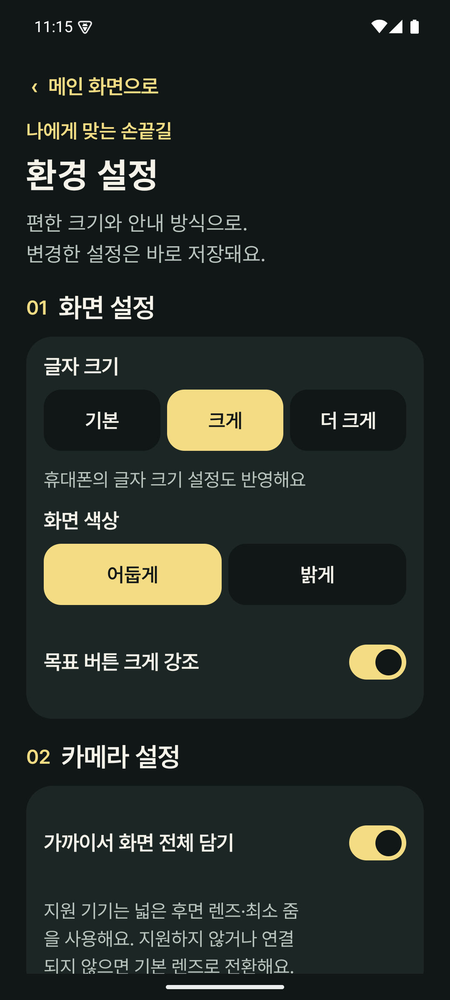 | 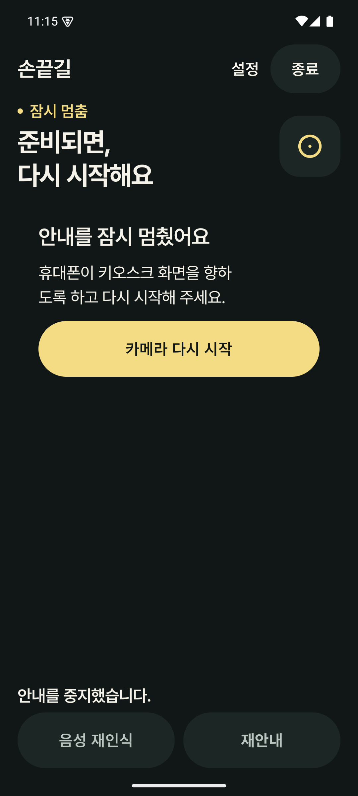 | 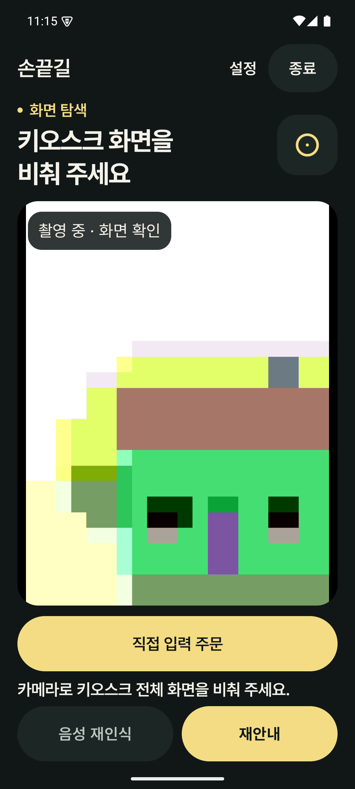 |

다음은 제품 컴포넌트에 고정 상태·독립 설정 저장소·글자 배율을 주입한 **Compose 테스트 캡처**다. 실제 AI 초기화 실패나 카메라 장애를 유발한 결과가 아니다.

| 밝은 테마 | 2.6배 글씨 | 2.6배 음성 설정 |
|---|---|---|
| 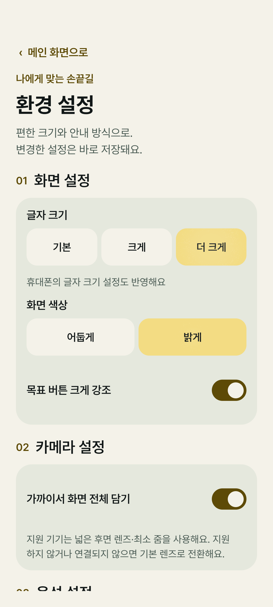 | 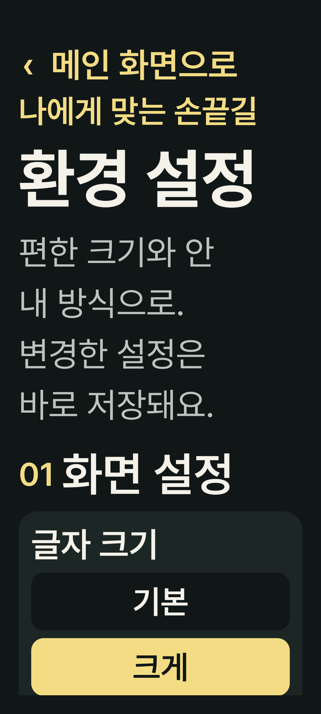 | 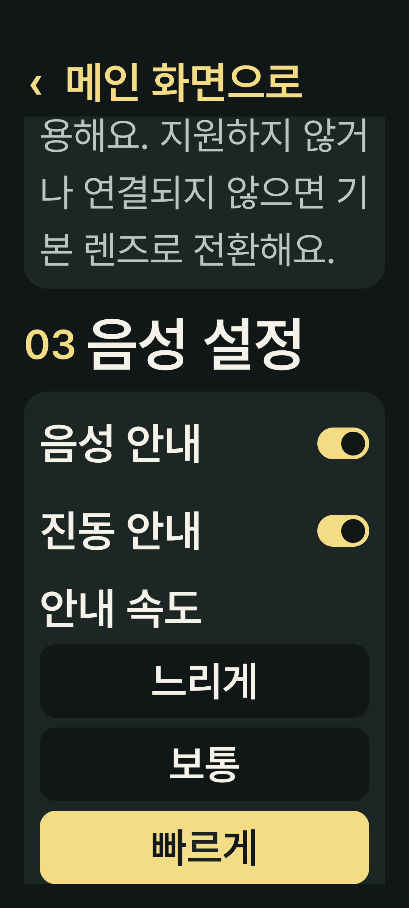 |

| AI 준비 실패 | 카메라 연결 실패 | 안내 완료 |
|---|---|---|
| 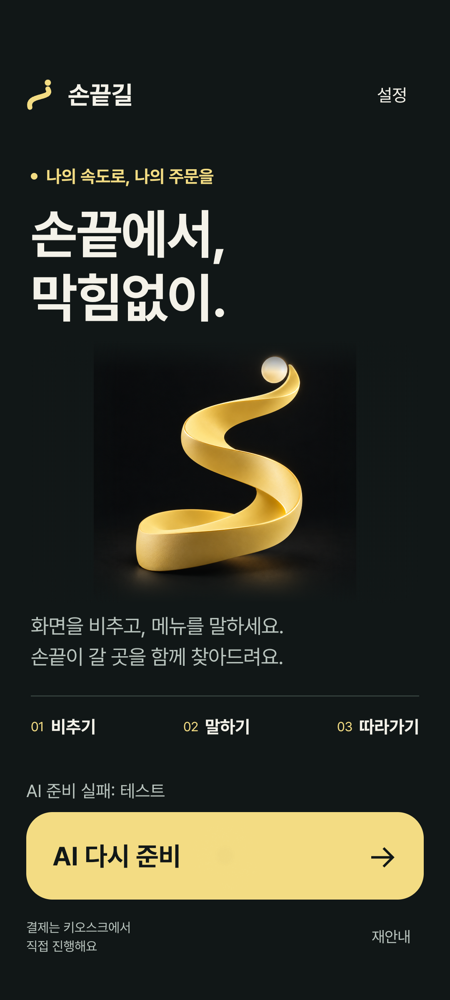 | 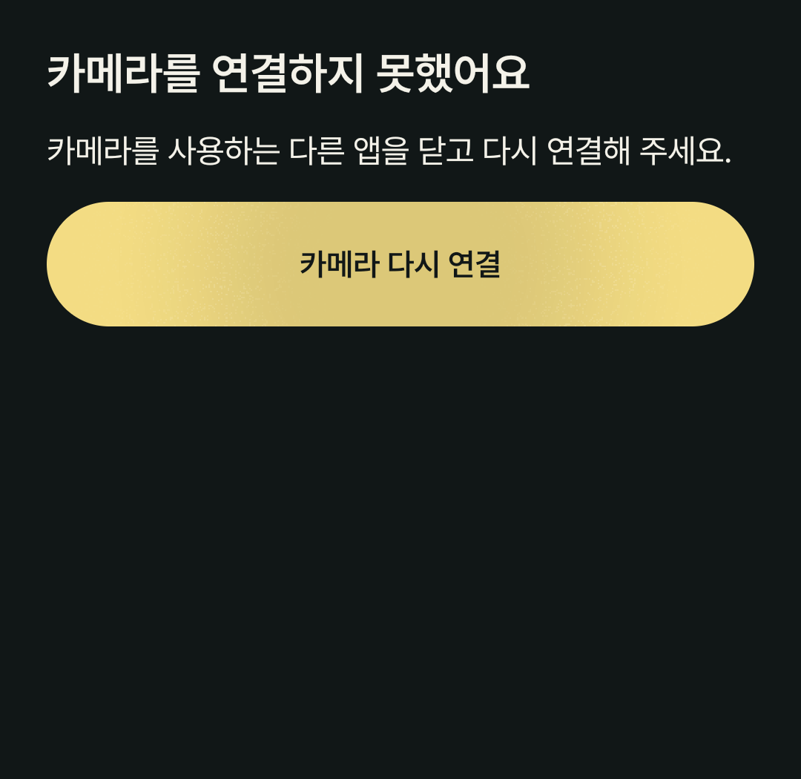 | 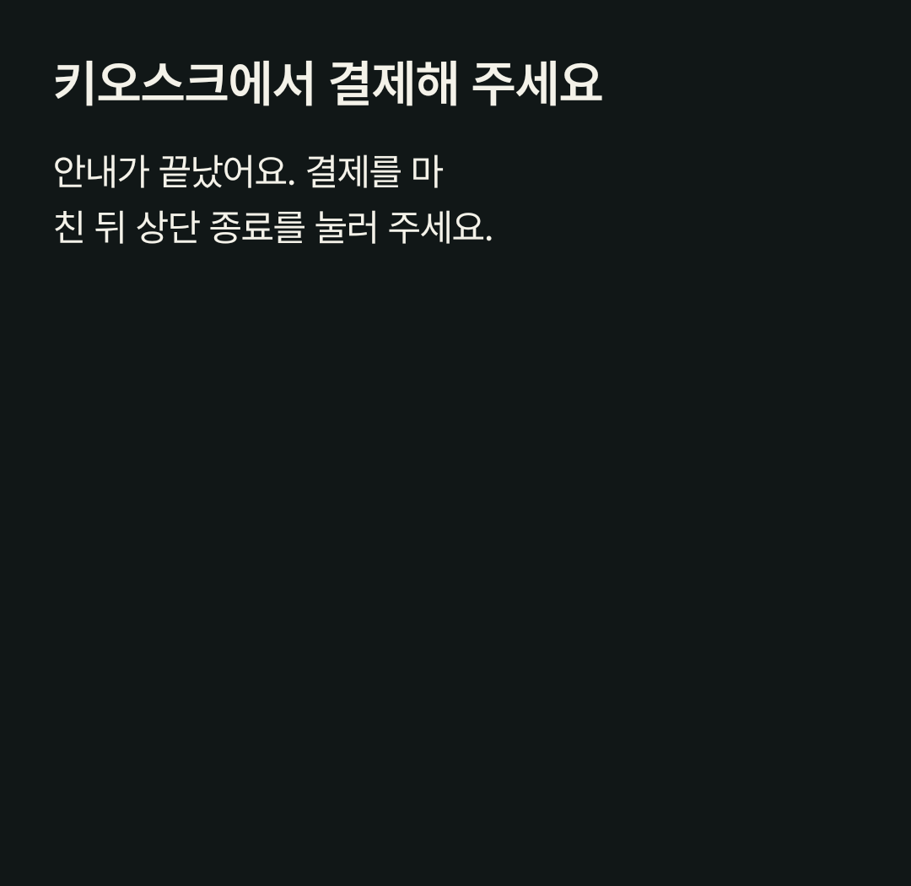 |

## 시각 변경

- 설정에 Signal 색상·글꼴·둥근 카드와 화면/카메라/음성 구획을 적용했다. 상단 돌아가기 위치를 고정하고 본문을 스크롤한다. 큰 글씨에서는 선택 항목을 세로로 배치하며 글자를 축소하지 않는다.
- 기존 `accessibility` SharedPreferences의 키·기본값·배율을 그대로 사용한다. 음성·진동·안내 속도·큰 목표 표시·넓은 렌즈 선택의 기존 모델 연결을 유지한다.
- 카메라 권한 필요, 연결 실패, 백그라운드 중지, 안내 완료를 각각 설명한다. 완료 상태에는 재시작 버튼을 표시하지 않는다. 음성 모델 창에도 같은 테마와 스크롤을 적용한다.
- 새 라이브러리·AI 모델·툴체인 업그레이드·외부 애니메이션 에셋은 없다. CameraX 좌표 변환·해상도·렌즈 선택과 주문 해석·수량·옵션 처리 정책은 유지한다.

## 시각 변경과 구분되는 UX·안정성 보완

1. AI 준비 실패 시 앱을 종료하지 않고 **AI 다시 준비**로 재시도한다. 초기화 중 중복 실행과 준비 전 시작을 막는다.
2. 마이크 권한 거절 시 직접 입력을 열고 대안을 알린다. 반복 거절로 시스템 설정이 필요하면 해당 앱 권한 설정으로 이동한다. 모델 다운로드를 자동 시작하지 않는다.
3. 녹음·처리·안내 중지 중에는 재안내를 비활성화하고 종료 시 이전 세션의 재안내를 지운다. 재안내는 가장 최근 실제 읽은 문장을 사용한다. 자동 음성이 꺼져 있어도 명시적 재안내를 허용하는 기존 정책은 유지한다.
4. 전역 네이티브 엔진의 초기화·명령·프레임 접근·마지막 해제를 `SharedEngineQueue`로 직렬화한다. 이전 모델이 늦게 해제되어 새 모델의 초기화 결과를 무효화하는 경합을 방지한다. 2차 테스트에서만 사용하던 해제 대기를 제거하고, Activity를 연속 교체하는 검사를 추가했다. 모든 실기기 카메라 지연이 해결됐다는 뜻은 아니다.
5. 설정 선택 항목은 radio 역할·선택 상태, 전체 스위치 행은 하나의 toggle 역할로 노출한다. 장식용 숫자와 내부 Switch의 중복 탐색을 제거한다. 돌아가기 → 제목 → 화면 → 카메라 → 음성 순서로 배치한다.
6. 주문 팝업의 paneTitle·heading·우선 탐색 그룹을 보완하고, 열려 있을 때 하단 상태의 live announcement를 억제한다. 닫으면 주문 보기의 **키보드 포커스**를 복구한다. TalkBack 접근성 포커스의 실제 이동은 별도 기기 검증이 필요하다.
7. TalkBack 상태 설명에 검증된 한글 방향을 포함하고 오래된 누르기 문장을 남기지 않는다. 기존 엔진 알림 번호 또는 상태 단계가 바뀔 때 갱신하며 카메라 프레임마다 새 live region을 만들지 않는다. 기존 TalkBack 활성 시 자동 TTS 중복 억제 정책을 유지한다.

제거했던 기기 음성 인식·상세 읽기 진입점·서버/매장 설정은 복구하지 않았다. 음성 재인식은 기존 비활성 자리 표시다. 주문 팝업 뒤 자동 안내, 설정 복귀 시 새 화면 확인, 백그라운드 복귀 시 수동 재시작 규칙도 유지한다.

## 검증 결과

- Kotlin 단위 검사 **106개 통과**, 실패·오류·생략 0. 기존 96개 + 엔진 수명 4개 + 복구/재안내/접근성 상태 6개.
- Android 계측 **25개 통과**, 실패·오류·생략 0. 기존 20개 + 설정/큰 글씨/복구 UI 4개 + 빠른 Activity 재실행 1개(3회 연속 생성·종료).
- 계측의 기존 앱 검사는 실제 주문 모델·메뉴·카메라 프레임 처리·중지/재개를 포함한다. 이전 테스트의 엔진 해제 대기 우회 없이 통과했다.
- Maestro 실제 터치 **1/1 통과**: 시작 화면 → 설정 → 시작 → 설정 왕복 후 촬영 → 홈 이동·복귀 → 수동 재시작 → 종료. 데이터·권한 초기화 없이 실행했다.
- 전달 release APK의 업데이트 이후 실제 터치 **1/1 통과**: 보존된 설정 → 촬영 프레임 수신 → 직접 입력 → 음성 모델 창 → 복귀 → 수동 카메라 재시작 → 종료. 별도 0.2.4 설정 저장 흐름도 통과했다. 주문 제출 자체는 위 계측 검사 범위이며 이 release 터치 흐름에서 새 주문을 제출하지 않았다.
- debug/release 강제 재빌드와 release 필수 lint 성공. 전달 APK는 이 빌드에서 복사했다. Kotlin 1.9.25, AGP 8.7.2, compiler 1.5.15, BOM 2024.09.03 유지.
- 선택·스위치 semantics, 버튼 접근, 2.6배 레이아웃은 자동 검사와 캡처로 확인했다. 실제 TalkBack 발화·포커스, 한국어 Whisper 마이크 인식, 물리 진동, 실제 키오스크/손끝/초광각은 미검증이다. 에뮬레이터의 가상 카메라와 고정 상태 캡처는 이를 대신하지 않는다.

로컬 증거: `artifacts/integration-stage3/full-validation.txt`, `maestro-stage3.txt`, Maestro 출력 폴더, Gradle XML 보고서. 초기 컴파일·환경 실행 로그도 같은 폴더에 보존한다. 테스트 재실행을 중복 합산하지 않는다.

## 전달 APK

| 용도 | 업데이트용 release | 별도 설치용 debug |
|---|---|---|
| 로컬 파일 | `artifacts/sonkkeut-0.3.0.apk` | `artifacts/sonkkeut-ui-update-stage3.apk` |
| 패키지 | `com.sonkkeut` | `com.sonkkeut.uiupdate` |
| 버전 | `0.3.0`, code 15 | `0.3.0-ui-stage3`, code 15 |
| 크기 | 69,998,844 bytes | 77,091,303 bytes |
| SHA-256 | `1d70382dad23f22592dce671b5ec3e2beb6b2a4af51129849e4216fd6f14883c` | `70e6ac28c8bd936c965a22f73611308bd85df16f6d160737ff7eaca4ee851384` |

Android 8.0 이상 ARM64, target SDK 35. release는 0.2.4와 같은 개발용 인증서 SHA-256 `fac61745dc0903786fb9ede62a962b399f7348f0bb6f899b8332667591033b9c`다. 자체 음성 모델은 APK에 포함하지 않는다. 2026-10-06 [0.3.0 릴리스](https://github.com/hy2oni/sonkkeut-frontend/releases/tag/develop-ui-0.3.0-20261006)에 공개했다. 배포 코드/태그 커밋은 `6e66ec232e556d70c2543e68593427500692eec5`이며 업로드된 APK의 GitHub SHA-256도 위 해시와 일치한다. 원본 동기화 [PR #9](https://github.com/fingertip-vision/sonkkeut-frontend/pull/9)는 `develop_ui/ux_v2` 대상으로 열려 있다.

## 0.2.4 → 0.3.0 업데이트 설치

기존 `emulator-5554`의 제품 앱을 보존하고 새 `Sonkkeut_Stage3_Update_Local` / `emulator-5556`에서만 검사했다. 같은 SDK의 Android 15 이미지를 재사용했다. 기존 AVD 동시 읽기 전용 실행은 지원되지 않았고 작업 폴더의 새 AVD도 부팅이 멈췄다. 임시 로컬 경로에 새 AVD를 만든 뒤 정상 부팅했다. 특정 원인으로 확정하지 않는다.

1. 기존 공개 파일과 해시가 같은 0.2.4/code 14를 새 기기에 설치하고 카메라·마이크 권한을 부여했다.
2. 실제 0.2.4 UI에서 ‘더 크게’와 ‘밝게’를 저장했다. 업데이트 전 XML의 `textSize=2`, `light=true`를 기록했다.
3. 검증한 release 파일을 `adb -s emulator-5556 install -r artifacts/sonkkeut-0.3.0.apk`로 설치했다. **Success**, 버전 0.3.0/code 15, 최초 설치 시각 유지, 카메라·마이크 권한 유지, 설정 XML 일치를 확인했다.
4. 0.3.0 실제 화면에서도 두 설정의 접근성 `checked=true`와 밝은/큰 글씨 렌더를 확인했다. 전달 파일과 설치된 `base.apk`의 SHA-256이 일치한다.

| 업데이트 전 0.2.4 설정 | 업데이트 후 실제 0.3.0 설정 | 실제 0.3.0 촬영 |
|---|---|---|
| 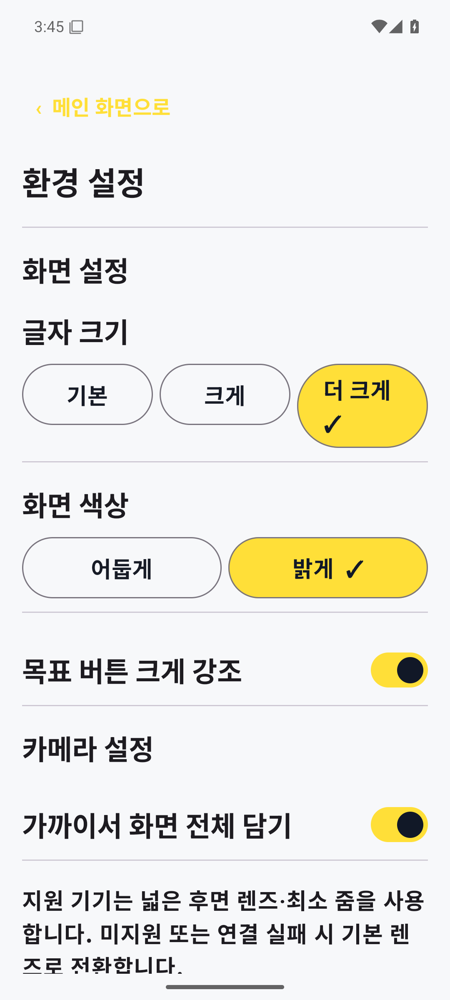 | 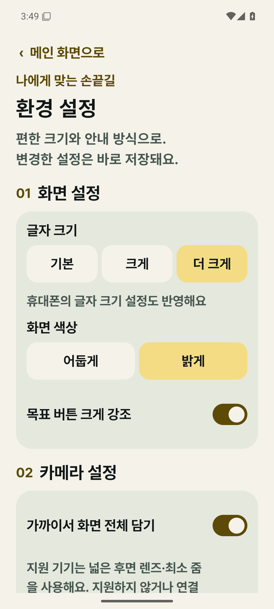 | 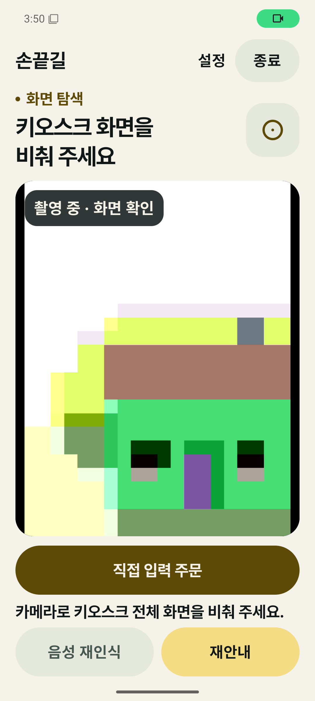 |

[실제 release 시작 화면](captures/stage3-release-home-actual.png) · [음성 모델 창](captures/stage3-release-voice-model-actual.png).

설정 보존 검사의 첫 Maestro 선택자는 Compose의 selected와 Android 접근성의 checked 매핑을 혼동해 실패했다. 실제 UI 트리와 [Maestro 상태 선택자](https://docs.maestro.dev/reference/selectors/state-selectors)를 확인해 선택된 부모의 checked를 검사하도록 고쳤다. 두 번째 실행은 설정·촬영·입력·모델 창까지 통과한 뒤 Maestro의 ADB 통신/heartbeat 파일 잠금 오류로 중단됐다. 앱 crash 버퍼는 비어 있었다. 재연결한 **최종 전체 흐름은 복귀·재시작·종료까지 모두 통과**했다(`update-release-verified.txt`). 최초 실패 로그도 보존한다.

원래 기기의 `com.sonkkeut`은 **0.2.4/code 14**, 최초/최종 설치 시각과 권한이 그대로이며 설치 APK 해시는 `12e705610533f7121fb8a1530961c75d847876d88031c47ba468441911a37c3f`로 유지됐다. 이전 1차·2차 APK 해시도 기존 기록과 같다. 저장된 음성 모델이 있는 실제 휴대폰의 업데이트 보존은 별도 검증 항목이다.

업데이트 증거: `update-before.txt`, `update-after.txt`, `update-preferences-before.xml`, `update-preferences-after.xml`, `old-signature.txt`, `new-signature.txt`, `release-installed-hash.txt`, `product-preserved.txt` / `product-preserved-hash.txt` (모두 로컬 `artifacts/integration-stage3/`).

성공한 임시 검증 AVD는 재현용으로 보존하고 종료했다. 등록 이름 `Sonkkeut_Stage3_Update_Local`, 데이터 위치 `%TEMP%/sonkkeut-stage3-update-local.avd`. 실패한 `Sonkkeut_Stage3_Update_Test`만 등록 경로·실행 여부를 확인한 뒤 정리했다. 기존 `Sonkkeut_Event_Test`와 `Pixel_6`는 보존했다.

## 재현

```powershell
. ./tools/ui/environment.ps1
# 기존 제품과 분리된 테스트 기기만 연결한 상태에서 실행
./gradlew.bat :app:testDebugUnitTest :app:assembleDebug :app:assembleRelease :app:connectedDebugAndroidTest -PuiIntegrationSandbox=true '-Pandroid.testInstrumentationRunnerArguments.class=com.sonkkeut.app.NativeAppTest,com.sonkkeut.app.NativeOrderLayoutTest,com.sonkkeut.app.SignalEntryIntegrationTest,com.sonkkeut.app.SignalWelcomeLayoutTest,com.sonkkeut.app.SignalSessionLayoutTest,com.sonkkeut.app.SignalStage3Test,com.sonkkeut.app.NativeRestartTest' --offline --rerun-tasks '-Dorg.gradle.jvmargs=-Xmx3072m -Dfile.encoding=COMPAT'
maestro --device emulator-5554 test --test-output-dir artifacts/integration-stage3/maestro tools/ui/stage3-smoke.yaml
# 다음 두 흐름은 기존 제품 기기에서 실행하지 않는다. 별도 업데이트 검증 기기 전용이다.
# 0.2.4 설치 후:
maestro --device emulator-5556 test tools/ui/stage3-update-before.yaml
# 동일 서명의 0.3.0을 install -r로 업데이트한 뒤:
maestro --device emulator-5556 test tools/ui/stage3-update-after.yaml
```

Context7로 Android Compose 문서를 조회하고 [공식 선택 항목 문서](https://developer.android.com/develop/ui/compose/components/radio-button)와 [기본 접근성 API](https://developer.android.com/develop/ui/compose/accessibility/api-defaults)를 확인했다. 현재 BOM에서 실제 컴파일·계측했다. Figma 파일을 새로 읽거나 디자인 출처를 바꾸지 않았다.

[PR 본문](PR_BODY.md) · [배포 설명](RELEASE_NOTES.md) · [Git 동기화 절차](GIT_HANDOFF.md)
